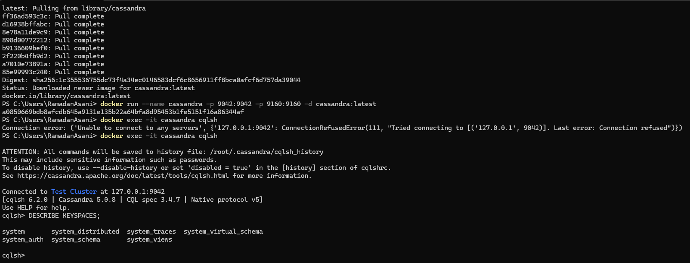
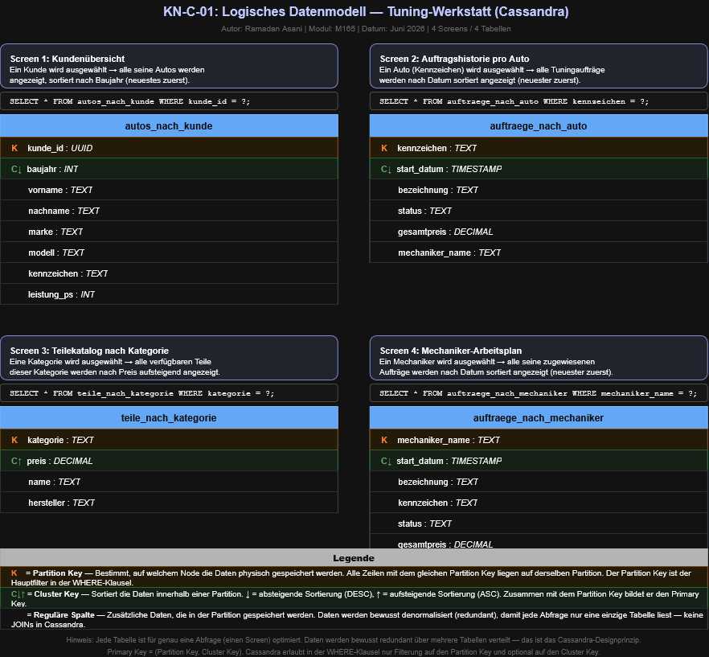
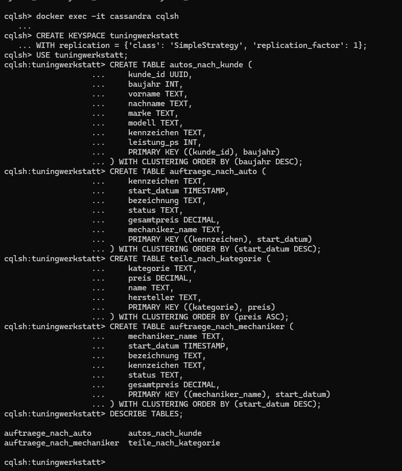

# KN-C-01: Installation und Datenmodellierung für Cassandra

**Autor:** Ramadan Asani
**Modul:** M165 - NoSQL-Datenbanken einsetzen
**Datum:** 11.06.2026
**Thema:** Tuning-Werkstatt (gleiches konzeptionelles Modell wie bei den MongoDB- und Neo4j-KNs)

---

## Inhaltsverzeichnis

- [Ausgangslage](#ausgangslage)
- [A) Installation / Account erstellen](#a-installation--account-erstellen)
- [B) Logisches Modell für Cassandra](#b-logisches-modell-für-cassandra)
  - [Vom konzeptionellen Modell zu Cassandra](#vom-konzeptionellen-modell-zu-cassandra)
  - [Die 4 Screens und ihre Tabellen](#die-4-screens-und-ihre-tabellen)
  - [Das logische Datenmodell](#das-logische-datenmodell)
  - [Erklärung zu Partition Keys und Cluster Keys](#erklärung-zu-partition-keys-und-cluster-keys)
- [C) Physisches Modell für Cassandra](#c-physisches-modell-für-cassandra)
- [Abgabe-Dateien](#abgabe-dateien)

---

## Ausgangslage

Dieser Kompetenznachweis bildet den Einstieg in den Cassandra-Teil des Moduls. Es wird eine Cassandra-Datenbank eingerichtet, ein logisches Datenmodell erstellt und anschliessend das physische Modell als CQL-Skript umgesetzt.

Als Grundlage dient dasselbe **konzeptionelle Modell** wie bei den MongoDB-Aufgaben (KN-M-02 bis KN-M-07) und den Neo4j-Aufgaben (KN-N-01 bis KN-N-03): die **Tuning-Werkstatt** mit Kunden, deren Autos, Tuningaufträgen, Tuningteilen und Mechanikern.

Während MongoDB die Daten als Dokumente mit Einbettungen und Referenzen speichert und Neo4j sie als Graph mit Knoten und Kanten abbildet, verfolgt Cassandra einen grundlegend anderen Ansatz: Die Datenmodellierung ist **abfragegetrieben**. Pro Screen bzw. Abfrage wird eine eigene Tabelle erstellt, und Daten werden bewusst redundant gespeichert, damit jede Abfrage nur eine einzige Tabelle lesen muss — ohne JOINs.

---

## A) Installation / Account erstellen

### Vorgehen

Cassandra wurde lokal über **Docker** installiert, gemäss der offiziellen Installationsanleitung des Moduls:

```powershell
docker pull cassandra:latest
docker run --name cassandra -p 9042:9042 -p 9160:9160 -d cassandra:latest
```

Nach einer kurzen Wartezeit (ca. 60 Sekunden, bis die Instanz vollständig hochgefahren ist) wurde die Verbindung über das Kommandozeilen-Tool **cqlsh** hergestellt:

```powershell
docker exec -it cassandra cqlsh
```

Zum Nachweis der funktionierenden Verbindung wurde der Befehl `DESCRIBE KEYSPACES;` ausgeführt, der die vorhandenen System-Keyspaces auflistet.

| Element            | Funktion                                                                  |
| ------------------ | ------------------------------------------------------------------------- |
| Docker             | Container-Plattform, auf der Cassandra als Image läuft.                   |
| cassandra:latest   | Offizielles Docker-Image von Apache Cassandra (Version 5.0.8).            |
| cqlsh              | Kommandozeilen-Shell für Cassandra, vergleichbar mit mongosh bei MongoDB. |
| DESCRIBE KEYSPACES | CQL-Befehl, der alle vorhandenen Keyspaces auflistet.                     |

### Screenshot



Der Screenshot zeigt die erfolgreiche Verbindung zum Test Cluster (Cassandra 5.0.8, CQL spec 3.4.7) und das Ergebnis von `DESCRIBE KEYSPACES` mit den Standard-System-Keyspaces.

---

## B) Logisches Modell für Cassandra

### Vom konzeptionellen Modell zu Cassandra

Bei Cassandra unterscheidet sich die Datenmodellierung grundlegend von MongoDB und Neo4j. Der zentrale Grundsatz lautet: **Man modelliert nicht die Daten, sondern die Abfragen.** Für jeden Screen bzw. jeden Anwendungsfall wird eine eigene Tabelle erstellt, die genau die Daten enthält, die dieser Screen benötigt — bereits in der richtigen Sortierung.

Die wichtigsten Konzepte:

- **Partition Key:** Bestimmt, auf welchem Node die Daten physisch gespeichert werden. Alle Zeilen mit dem gleichen Partition Key liegen auf derselben Partition. In der CQL-Abfrage muss der Partition Key immer in der WHERE-Klausel angegeben werden.
- **Cluster Key:** Sortiert die Daten innerhalb einer Partition. Die Sortierrichtung (ASC oder DESC) wird beim Erstellen der Tabelle festgelegt.
- **Primary Key:** Die Kombination aus Partition Key und Cluster Key. Er identifiziert jede Zeile eindeutig.
- **Denormalisierung:** Daten werden bewusst redundant über mehrere Tabellen verteilt. Das ist das Gegenteil der Normalisierung in relationalen Datenbanken, aber genau so gewollt — denn Cassandra kennt keine JOINs.

### Die 4 Screens und ihre Tabellen

Ausgehend vom konzeptionellen Modell wurden vier Screens definiert, die typische Anwendungsfälle der Tuning-Werkstatt abdecken:

**Screen 1 — Kundenübersicht:**
Ein Kunde wird ausgewählt, und alle seine Autos werden angezeigt, sortiert nach Baujahr (neuestes zuerst). Die Tabelle `autos_nach_kunde` verwendet `kunde_id` als Partition Key, damit alle Autos eines Kunden auf derselben Partition liegen und mit einer einzigen Abfrage gelesen werden können. Der Cluster Key `baujahr DESC` sorgt dafür, dass das neueste Auto zuoberst erscheint.

**Screen 2 — Auftragshistorie pro Auto:**
Ein Auto wird über sein Kennzeichen ausgewählt, und alle zugehörigen Tuningaufträge werden nach Datum sortiert angezeigt (neuester zuerst). Die Tabelle `auftraege_nach_auto` partitioniert nach `kennzeichen` und clustert nach `start_datum DESC`. Der Mechanikername wird direkt in der Tabelle gespeichert (denormalisiert), damit kein JOIN nötig ist.

**Screen 3 — Teilekatalog nach Kategorie:**
Eine Kategorie wird ausgewählt (z.B. „Fahrwerk" oder „Auspuff"), und alle verfügbaren Tuningteile dieser Kategorie werden nach Preis aufsteigend angezeigt. Die Tabelle `teile_nach_kategorie` partitioniert nach `kategorie` und clustert nach `preis ASC`, sodass das günstigste Teil zuerst erscheint.

**Screen 4 — Mechaniker-Arbeitsplan:**
Ein Mechaniker wird ausgewählt, und alle seine zugewiesenen Aufträge werden nach Datum sortiert angezeigt (neuester zuerst). Die Tabelle `auftraege_nach_mechaniker` partitioniert nach `mechaniker_name` und clustert nach `start_datum DESC`. Auch hier werden Daten wie das Kennzeichen direkt in der Tabelle gespeichert, um JOINs zu vermeiden.

### Das logische Datenmodell

Das Modell wurde mit **draw.io** erstellt. Die Original-Datei ist als `KN-C-01_Datenmodell.drawio` beigelegt.



Für eine bessere Darstellung wurde zusätzlich eine aufbereitete Visualisierung generiert:


Beide Darstellungen zeigen alle vier Screens mit ihren zugehörigen CQL-Abfragen und Tabellen. Partition Keys sind orange markiert (K), Cluster Keys grün (C), und reguläre Spalten weiss. Die Legende erklärt die Bedeutung der Farben und Symbole.

### Erklärung zu Partition Keys und Cluster Keys

Die Wahl der Keys folgt einer klaren Logik: Der **Partition Key** entspricht immer dem Hauptfilter der Abfrage — also dem Wert, nach dem der Benutzer sucht (z.B. ein bestimmter Kunde, ein bestimmtes Kennzeichen, eine bestimmte Kategorie). Der **Cluster Key** bestimmt die Sortierung der Ergebnisse innerhalb dieser Partition (z.B. nach Datum oder Preis).

| Tabelle                     | Partition Key     | Cluster Key        | Begründung                                           |
| --------------------------- | ----------------- | ------------------ | ---------------------------------------------------- |
| `autos_nach_kunde`          | `kunde_id`        | `baujahr DESC`     | Suche nach Kunde → Autos sortiert nach Baujahr       |
| `auftraege_nach_auto`       | `kennzeichen`     | `start_datum DESC` | Suche nach Auto → Aufträge sortiert nach Datum       |
| `teile_nach_kategorie`      | `kategorie`       | `preis ASC`        | Suche nach Kategorie → Teile sortiert nach Preis     |
| `auftraege_nach_mechaniker` | `mechaniker_name` | `start_datum DESC` | Suche nach Mechaniker → Aufträge sortiert nach Datum |

---

## C) Physisches Modell für Cassandra

### Vorgehen

Das physische Modell wurde als CQL-Skript umgesetzt. Zuerst wurde ein **Keyspace** `tuningwerkstatt` erstellt (mit `SimpleStrategy` und Replikationsfaktor 1, da es sich um eine lokale Entwicklungsumgebung handelt), anschliessend die vier Tabellen gemäss dem logischen Modell.

Die Tabellen verwenden `CREATE TABLE IF NOT EXISTS`, damit das Skript mehrfach ausgeführt werden kann, ohne Fehler zu verursachen. Die `CLUSTERING ORDER BY`-Klausel legt die Sortierrichtung des Cluster Keys fest.

### Skript

Das vollständige CQL-Skript ist in der Datei `KN-C-01_physisches_modell.cql` enthalten. Hier ein Auszug der ersten Tabelle als Beispiel:

```sql
CREATE KEYSPACE IF NOT EXISTS tuningwerkstatt
WITH replication = {'class': 'SimpleStrategy', 'replication_factor': 1};

USE tuningwerkstatt;

CREATE TABLE IF NOT EXISTS autos_nach_kunde (
    kunde_id    UUID,
    baujahr     INT,
    vorname     TEXT,
    nachname    TEXT,
    marke       TEXT,
    modell      TEXT,
    kennzeichen TEXT,
    leistung_ps INT,
    PRIMARY KEY ((kunde_id), baujahr)
) WITH CLUSTERING ORDER BY (baujahr DESC);
```

Die doppelten Klammern um `(kunde_id)` in der PRIMARY-KEY-Definition kennzeichnen den Partition Key. Alles danach (hier `baujahr`) ist der Cluster Key.

### Screenshot



Der Screenshot zeigt die erfolgreiche Ausführung aller `CREATE TABLE`-Befehle im Keyspace `tuningwerkstatt` und die Ausgabe von `DESCRIBE TABLES` mit allen vier Tabellen.

---

## Abgabe-Dateien

| Datei                                                                       | Inhalt                                                    |
| --------------------------------------------------------------------------- | --------------------------------------------------------- |
| `KN-C-01_physisches_modell.cql`                                             | CQL-Skript zum Erstellen des Keyspaces und der 4 Tabellen |
| `KN-C-01_Datenmodell.drawio`                                                | Original-Datei des logischen Datenmodells (draw.io)       |
| `Bilder/A_cqlsh_verbindung.png`                                             | Screenshot: funktionierende Verbindung via cqlsh          |
| `Bilder/B_logisches_datenmodell.drawio.png`                                 | Logisches Datenmodell (draw.io Export)                    |
| `Bilder/B_Generiertes Bild_ Datenmodell für Tuning-Werkstatt Übersicht.png` | Logisches Datenmodell (aufbereitete Visualisierung)       |
| `Bilder/C_physisches_modell.png`                                            | Screenshot: physisches Modell erstellt                    |
| `KN-C-01_Installation_und_Datenmodellierung_Cassandra.md`                   | Diese Dokumentation                                       |
