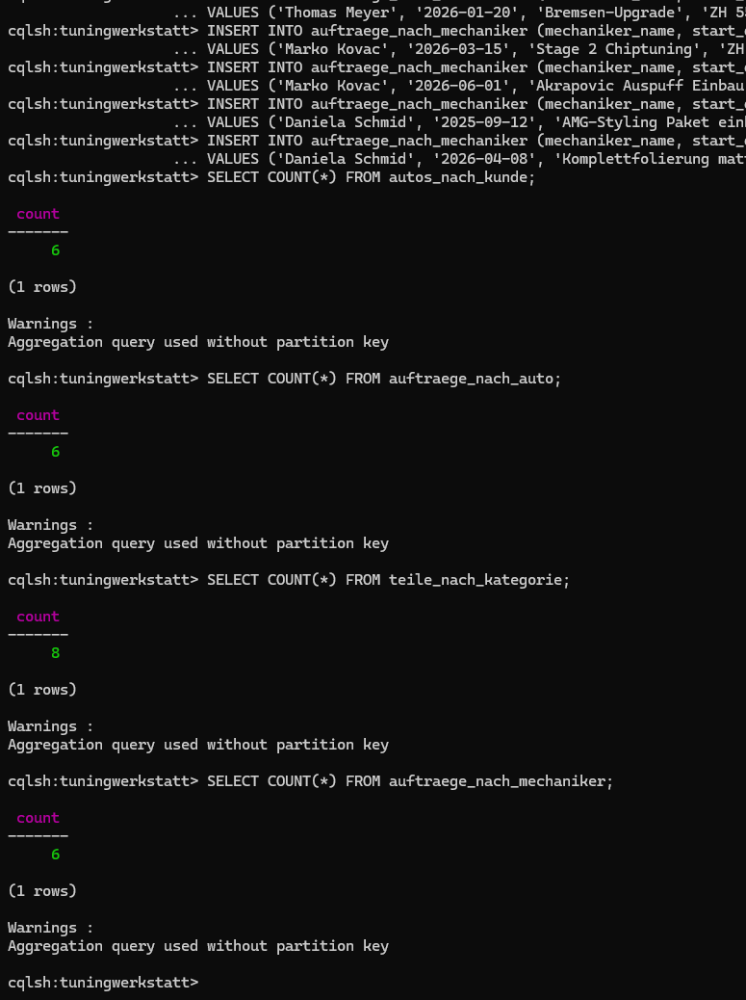
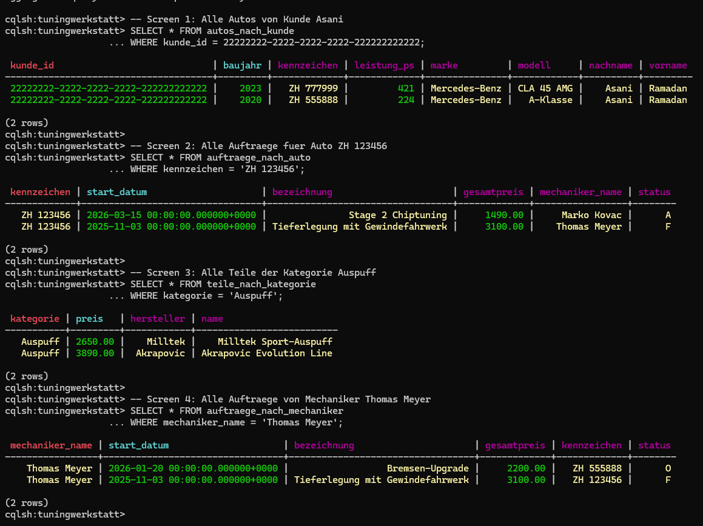
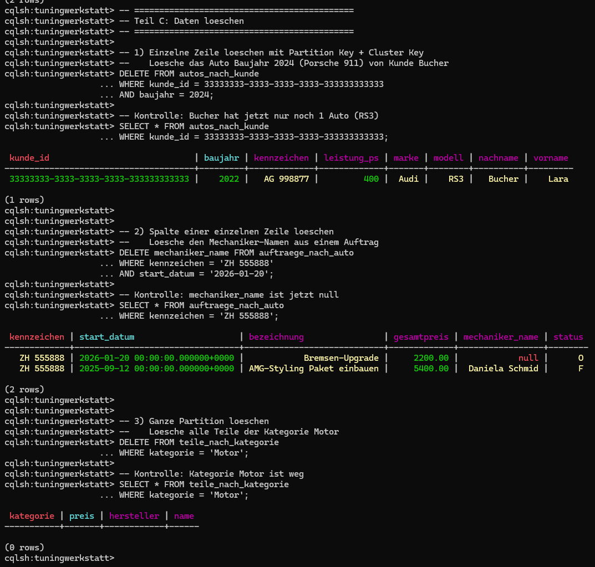
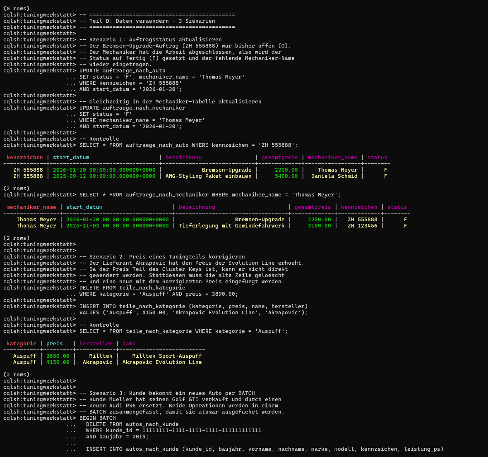

# KN-C-02: Datenabfrage und -Manipulation

**Autor:** Ramadan Asani
**Modul:** M165 - NoSQL-Datenbanken einsetzen
**Datum:** 11.06.2026
**Thema:** Tuning-Werkstatt (Cassandra, aufbauend auf KN-C-01)

---

## Inhaltsverzeichnis

- [Ausgangslage](#ausgangslage)
- [A) Daten hinzufügen](#a-daten-hinzufügen)
- [B) Daten abfragen](#b-daten-abfragen)
- [C) Daten löschen](#c-daten-löschen)
- [D) Daten verändern](#d-daten-verändern)
- [Abgabe-Dateien](#abgabe-dateien)

---

## Ausgangslage

In KN-C-01 wurde das physische Datenmodell mit vier Tabellen erstellt. In diesem Kompetenznachweis werden diese Tabellen mit Daten befüllt, abgefragt, teilweise gelöscht und verändert.

Alle Befehle werden über **cqlsh** ausgeführt (Cassandra 5.0.8 im Docker-Container). Die Tabellen im Keyspace `tuningwerkstatt` sind:

| Tabelle                     | Partition Key     | Cluster Key        |
| --------------------------- | ----------------- | ------------------ |
| `autos_nach_kunde`          | `kunde_id`        | `baujahr DESC`     |
| `auftraege_nach_auto`       | `kennzeichen`     | `start_datum DESC` |
| `teile_nach_kategorie`      | `kategorie`       | `preis ASC`        |
| `auftraege_nach_mechaniker` | `mechaniker_name` | `start_datum DESC` |

---

## A) Daten hinzufügen

### Vorgehen

Alle vier Tabellen wurden mit INSERT-Befehlen befüllt. Um die Bedingung zu erfüllen, dass **pro Partition Key mehrere Datensätze** vorhanden sind, wurden die Daten entsprechend aufgeteilt:

- **autos_nach_kunde:** 3 Kunden (= 3 Partitionen) mit je 2 Autos = 6 Zeilen. Beispiel: Kunde Mueller besitzt einen Golf GTI (2019) und einen BMW M3 (2021) — beide Zeilen liegen in derselben Partition, weil sie dieselbe `kunde_id` haben.
- **auftraege_nach_auto:** 3 Kennzeichen (= 3 Partitionen) mit je 2 Aufträgen = 6 Zeilen.
- **teile_nach_kategorie:** 4 Kategorien (= 4 Partitionen) mit je 2 Teilen = 8 Zeilen.
- **auftraege_nach_mechaniker:** 3 Mechaniker (= 3 Partitionen) mit je 2 Aufträgen = 6 Zeilen.

Insgesamt wurden **26 Datensätze** eingefügt.

Als Kunde-IDs wurden feste UUIDs verwendet (z.B. `11111111-1111-1111-1111-111111111111`), damit die Daten in den Abfragen reproduzierbar referenziert werden können.

### Screenshot



---

## B) Daten abfragen

### Vorgehen

Für jeden der vier Screens aus KN-C-01 wurde die entsprechende SELECT-Abfrage ausgeführt. Bei Cassandra muss in der WHERE-Klausel immer der **Partition Key** angegeben werden — das ist die zentrale Einschränkung gegenüber SQL. Dafür liest Cassandra nur eine einzige Partition und liefert die Daten bereits in der definierten Cluster-Key-Reihenfolge.

**Screen 1 — Alle Autos von Kunde Asani:**

```sql
SELECT * FROM autos_nach_kunde
WHERE kunde_id = 22222222-2222-2222-2222-222222222222;
```

Ergebnis: 2 Zeilen — CLA 45 AMG (2023) zuerst, dann A-Klasse (2020), sortiert nach `baujahr DESC`.

**Screen 2 — Alle Aufträge für Auto ZH 123456:**

```sql
SELECT * FROM auftraege_nach_auto
WHERE kennzeichen = 'ZH 123456';
```

Ergebnis: 2 Zeilen — Stage 2 Chiptuning (2026-03) zuerst, dann Tieferlegung (2025-11), sortiert nach `start_datum DESC`.

**Screen 3 — Alle Teile der Kategorie Auspuff:**

```sql
SELECT * FROM teile_nach_kategorie
WHERE kategorie = 'Auspuff';
```

Ergebnis: 2 Zeilen — Milltek (2650 CHF) zuerst, dann Akrapovic (3890 CHF), sortiert nach `preis ASC`.

**Screen 4 — Alle Aufträge von Mechaniker Thomas Meyer:**

```sql
SELECT * FROM auftraege_nach_mechaniker
WHERE mechaniker_name = 'Thomas Meyer';
```

Ergebnis: 2 Zeilen — Bremsen-Upgrade (2026-01) zuerst, dann Tieferlegung (2025-11), sortiert nach `start_datum DESC`.

### Screenshot



---

## C) Daten löschen

### Vorgehen

Drei verschiedene Löschoperationen wurden durchgeführt, um die unterschiedlichen Möglichkeiten von Cassandra zu zeigen:

**1) Einzelne Zeile löschen (Partition Key + Cluster Key):**

```sql
DELETE FROM autos_nach_kunde
WHERE kunde_id = 33333333-3333-3333-3333-333333333333
AND baujahr = 2024;
```

Löscht den Porsche 911 GT3 von Kunde Bucher. Danach hat Bucher nur noch 1 Auto (Audi RS3).

**2) Spalte einer einzelnen Zeile löschen:**

```sql
DELETE mechaniker_name FROM auftraege_nach_auto
WHERE kennzeichen = 'ZH 555888'
AND start_datum = '2026-01-20';
```

Löscht nur die Spalte `mechaniker_name` aus dem Bremsen-Upgrade-Auftrag. Im Ergebnis erscheint der Wert als `null` — die restlichen Spalten der Zeile bleiben erhalten. Das ist eine Cassandra-spezifische Funktion: Mit `DELETE spaltenname FROM tabelle` können einzelne Spalten gezielt gelöscht werden, ohne die ganze Zeile zu entfernen.

**3) Ganze Partition löschen:**

```sql
DELETE FROM teile_nach_kategorie
WHERE kategorie = 'Motor';
```

Löscht alle Teile der Kategorie Motor (beide Zeilen). Es reicht, nur den Partition Key anzugeben — Cassandra löscht dann alle Zeilen dieser Partition.

### Aufräum-Skript

Das Skript `KN-C-02_C_cleanup.txt` löscht mit `TRUNCATE` alle Daten aus allen vier Tabellen, damit die Datenbank für einen Neustart bereit ist. Die Tabellenstruktur bleibt dabei erhalten.

### Screenshot



---

## D) Daten verändern

### Szenario 1: Auftragsstatus aktualisieren (UPDATE auf 2 Tabellen)

**Ausgangslage:** Der Bremsen-Upgrade-Auftrag (Kennzeichen ZH 555888) hatte den Status „offen" (O). Der Mechaniker Thomas Meyer hat die Arbeit nun abgeschlossen. Ausserdem war der Mechaniker-Name zuvor gelöscht worden (in Teil C) und muss wieder eingetragen werden.

**Herausforderung:** Da Cassandra denormalisiert ist, steckt die gleiche Information in zwei Tabellen (`auftraege_nach_auto` und `auftraege_nach_mechaniker`). Beide müssen separat aktualisiert werden — es gibt keinen JOIN oder eine automatische Synchronisierung.

```sql
UPDATE auftraege_nach_auto
SET status = 'F', mechaniker_name = 'Thomas Meyer'
WHERE kennzeichen = 'ZH 555888' AND start_datum = '2026-01-20';

UPDATE auftraege_nach_mechaniker
SET status = 'F'
WHERE mechaniker_name = 'Thomas Meyer' AND start_datum = '2026-01-20';
```

### Szenario 2: Preis eines Tuningteils korrigieren (DELETE + INSERT)

**Ausgangslage:** Der Lieferant Akrapovic hat den Preis der Evolution Line von 3890 CHF auf 4150 CHF erhöht. Der Preis muss in der Tabelle `teile_nach_kategorie` angepasst werden.

**Herausforderung:** Der Preis ist der **Cluster Key** dieser Tabelle. In Cassandra können Primary-Key-Spalten (weder Partition Key noch Cluster Key) mit UPDATE verändert werden. Die Lösung ist ein DELETE der alten Zeile und ein INSERT der neuen Zeile mit dem korrigierten Preis.

```sql
DELETE FROM teile_nach_kategorie
WHERE kategorie = 'Auspuff' AND preis = 3890.00;

INSERT INTO teile_nach_kategorie (kategorie, preis, name, hersteller)
VALUES ('Auspuff', 4150.00, 'Akrapovic Evolution Line', 'Akrapovic');
```

### Szenario 3: Autotausch per BATCH (DELETE + INSERT atomar)

**Ausgangslage:** Kunde Mueller hat seinen Golf GTI (Baujahr 2019) verkauft und durch einen neuen Audi RS6 Avant (Baujahr 2025, 630 PS) ersetzt.

**Herausforderung:** Zwei Operationen (altes Auto entfernen, neues einfügen) müssen zusammen ausgeführt werden. Ein BATCH in Cassandra garantiert, dass entweder beide Operationen ausgeführt werden oder keine — ähnlich wie eine Transaktion, aber technisch kein vollständiges ACID-Verhalten.

```sql
BEGIN BATCH
  DELETE FROM autos_nach_kunde
  WHERE kunde_id = 11111111-1111-1111-1111-111111111111 AND baujahr = 2019;

  INSERT INTO autos_nach_kunde (kunde_id, baujahr, vorname, nachname, marke, modell, kennzeichen, leistung_ps)
  VALUES (11111111-1111-1111-1111-111111111111, 2025, 'Hans', 'Mueller', 'Audi', 'RS6 Avant', 'ZH 999111', 630);
APPLY BATCH;
```

### Screenshot



---

## Abgabe-Dateien

| Datei                                      | Inhalt                                         |
| ------------------------------------------ | ---------------------------------------------- |
| `KN-C-02_A_insert.txt`                     | Skript: Daten einfügen (26 INSERT-Befehle)     |
| `KN-C-02_B_select.txt`                     | Skript: Daten abfragen (4 SELECT-Befehle)      |
| `KN-C-02_C_delete.txt`                     | Skript: Daten löschen (3 Löschoperationen)     |
| `KN-C-02_C_cleanup.txt`                    | Skript: Alle Daten löschen (TRUNCATE)          |
| `KN-C-02_D_update.txt`                     | Skript: Daten verändern (3 Szenarien)          |
| `Bilder/A_insert.png`                      | Screenshot: INSERT-Befehle mit COUNT-Kontrolle |
| `Bilder/B_select.png`                      | Screenshot: SELECT-Abfragen                    |
| `Bilder/C_delete.png`                      | Screenshot: Löschoperationen mit Kontrolle     |
| `Bilder/D_update.png`                      | Screenshot: Update-Szenarien mit Kontrolle     |
| `KN-C-02_Datenabfrage_und_Manipulation.md` | Diese Dokumentation                            |
