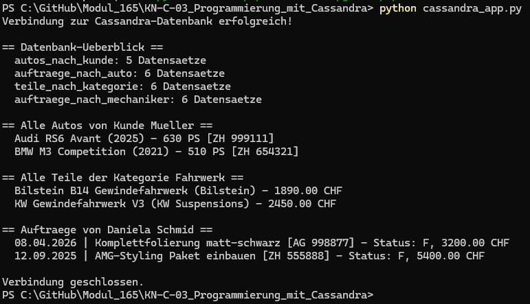

# KN-C-03: Programmierung mit Cassandra

**Autor:** Ramadan Asani
**Modul:** M165 - NoSQL-Datenbanken einsetzen
**Datum:** 11.06.2026
**Thema:** Tuning-Werkstatt (gleiche Datenbank wie in KN-C-01 und KN-C-02)

---

## Inhaltsverzeichnis

- [Ausgangslage](#ausgangslage)
- [Gewählte Sprache und Bibliothek](#gewählte-sprache-und-bibliothek)
- [Vorbereitung](#vorbereitung)
- [Das Programm](#das-programm)
- [Ausführung und Ergebnis](#ausführung-und-ergebnis)
- [Erklärung der Abfragen](#erklärung-der-abfragen)
- [Abgabe-Dateien](#abgabe-dateien)

---

## Ausgangslage

In diesem Kompetenznachweis wird die bestehende Cassandra-Datenbank (Tuning-Werkstatt aus KN-C-01 und KN-C-02) nicht mehr über cqlsh, sondern über eine **Programmiersprache** angesprochen. Ziel ist das Kennenlernen einer **Bibliothek (Treiber)**, mit der man aus dem Programmcode heraus auf die Datenbank zugreift und CQL-Abfragen ausführt.

Als Datenbank dient die lokale Cassandra-Instanz, die als Docker-Container läuft (Cassandra 5.0.8, Port 9042). Als Einstiegspunkt wurde die offizielle Seite <https://cassandra.apache.org/doc/latest/cassandra/getting-started/drivers.html> verwendet.

---

## Gewählte Sprache und Bibliothek

- **Sprache:** Python 3.13
- **Bibliothek:** offizieller **DataStax Python Driver** (`cassandra-driver`)

Python wurde gewählt, weil der Zugriff damit besonders einfach ist und der offizielle Treiber von DataStax gut dokumentiert ist. Der gleiche Ansatz wurde bereits in KN-N-03 für Neo4j verwendet.

---

## Vorbereitung

### Treiber installieren

Der Treiber wird über den Paketmanager `pip` installiert:

```bash
python -m pip install cassandra-driver
```

Installiert wurde die Version `cassandra-driver 3.30.0`.

**Hinweis zu Python 3.12+:** Ab Python 3.12 wurde das Modul `asyncore` aus der Standardbibliothek entfernt, das der Treiber beim Import benötigt. Die Lösung ist die Installation des Ersatzpakets:

```bash
python -m pip install pyasyncore
```

Alternativ kann im Code die `AsyncioConnection`-Klasse verwendet werden (siehe Skript).

### Voraussetzung

Der Cassandra-Docker-Container muss laufen und der Keyspace `tuningwerkstatt` mit Daten befüllt sein (aus KN-C-02 Teil A).

---

## Das Programm

Das Skript `cassandra_app.py` baut über den Treiber eine Verbindung auf und führt vier Abfragen aus.

```python
from cassandra.io.asyncioreactor import AsyncioConnection
from cassandra.cluster import Cluster


def main():
    # Verbindung aufbauen (localhost, Standard-Port 9042)
    # AsyncioConnection wird benoetigt ab Python 3.12+
    cluster = Cluster(["127.0.0.1"], connect_timeout=10)
    cluster.connection_class = AsyncioConnection
    session = cluster.connect("tuningwerkstatt")
    print("Verbindung zur Cassandra-Datenbank erfolgreich!\n")

    # 1) Ueberblick: Anzahl Datensaetze pro Tabelle
    print("== Datenbank-Ueberblick ==")
    tabellen = [
        "autos_nach_kunde",
        "auftraege_nach_auto",
        "teile_nach_kategorie",
        "auftraege_nach_mechaniker",
    ]
    for tabelle in tabellen:
        rows = session.execute(f"SELECT COUNT(*) AS anzahl FROM {tabelle}")
        print(f"  {tabelle}: {rows.one().anzahl} Datensaetze")
    print()

    # 2) Screen 1: Alle Autos von Kunde Mueller - Abfrage mit Parametern
    print("== Alle Autos von Kunde Mueller ==")
    from uuid import UUID

    mueller_id = UUID("11111111-1111-1111-1111-111111111111")
    rows = session.execute(
        "SELECT baujahr, marke, modell, kennzeichen, leistung_ps "
        "FROM autos_nach_kunde WHERE kunde_id = %s",
        (mueller_id,),
    )
    for row in rows:
        print(f"  {row.marke} {row.modell} ({row.baujahr}) - {row.leistung_ps} PS [{row.kennzeichen}]")
    print()

    # 3) Screen 3: Teile einer bestimmten Kategorie
    print("== Alle Teile der Kategorie Fahrwerk ==")
    rows = session.execute(
        "SELECT name, hersteller, preis FROM teile_nach_kategorie WHERE kategorie = %s",
        ("Fahrwerk",),
    )
    for row in rows:
        print(f"  {row.name} ({row.hersteller}) - {row.preis} CHF")
    print()

    # 4) Screen 4: Auftraege eines Mechanikers
    print("== Auftraege von Daniela Schmid ==")
    rows = session.execute(
        "SELECT start_datum, bezeichnung, kennzeichen, status, gesamtpreis "
        "FROM auftraege_nach_mechaniker WHERE mechaniker_name = %s",
        ("Daniela Schmid",),
    )
    for row in rows:
        datum = row.start_datum.strftime("%d.%m.%Y")
        print(f"  {datum} | {row.bezeichnung} [{row.kennzeichen}] - Status: {row.status}, {row.gesamtpreis} CHF")
    print()

    # Verbindung schliessen
    cluster.shutdown()
    print("Verbindung geschlossen.")


if __name__ == "__main__":
    main()
```

---

## Ausführung und Ergebnis

Das Skript wird im Terminal ausgeführt:

```bash
python cassandra_app.py
```

Die Ausgabe bestätigt die erfolgreiche Verbindung und liefert die Ergebnisse der vier Abfragen.

### Screenshot



---

## Erklärung der Abfragen

- **`Cluster(["127.0.0.1"])`** erstellt ein Cluster-Objekt, das sich mit dem lokalen Cassandra-Node verbindet. Mit `cluster.connection_class = AsyncioConnection` wird die asyncio-basierte Verbindungsklasse gesetzt, die ab Python 3.12 benötigt wird. `cluster.connect("tuningwerkstatt")` öffnet eine Session auf dem gewünschten Keyspace — vergleichbar mit `USE tuningwerkstatt` in cqlsh.
- **`session.execute(...)`** führt eine CQL-Abfrage aus und gibt die Ergebniszeilen zurück. Auf einzelne Spalten wird per Attribut-Name zugegriffen (z.B. `row.marke`, `row.preis`).
- **Abfrage 1** zählt die Datensätze in allen vier Tabellen — ein einfacher Bestandstest.
- **Abfrage 2** verwendet **Parameter** (`%s`) statt fest eingebaute Werte. Die UUID wird als Python-`UUID`-Objekt übergeben, nicht als String. Das ist die empfohlene Vorgehensweise: Die Werte werden getrennt vom Abfrage-Text übergeben, was sicherer und wiederverwendbar ist.
- **Abfrage 3** fragt die Teile einer bestimmten Kategorie ab — auch hier mit Parametern.
- **Abfrage 4** greift auf die Mechaniker-Tabelle zu und formatiert das Datum mit `strftime()` in ein lesbares Format.

Damit ist gezeigt, dass dieselben CQL-Abfragen wie in cqlsh auch programmatisch über den Python-Treiber ausgeführt werden können.

---

## Abgabe-Dateien

| Datei                                 | Inhalt                                                     |
| ------------------------------------- | ---------------------------------------------------------- |
| `cassandra_app.py`                    | Python-Skript, das über den Treiber auf Cassandra zugreift |
| `Bilder/ausgabe.png`                  | Screenshot der erfolgreichen Ausführung im Terminal        |
| `KN-C-03_Programmierung_Cassandra.md` | Diese Dokumentation                                        |
