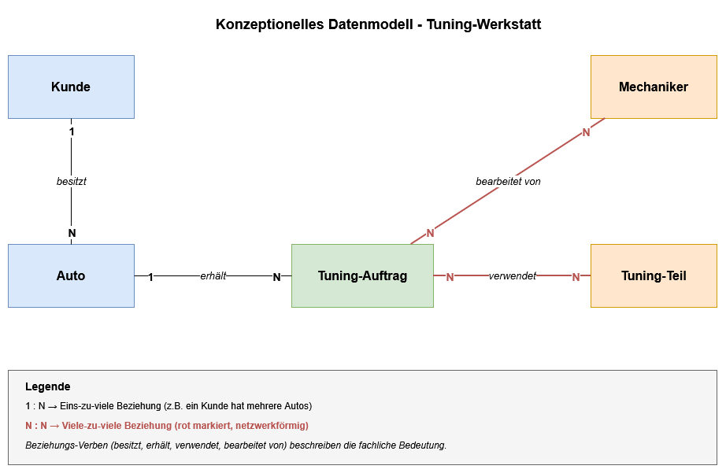
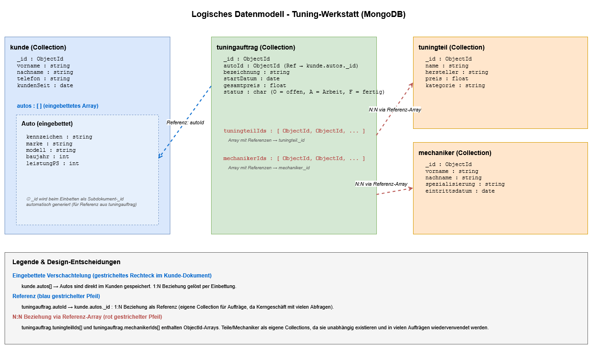
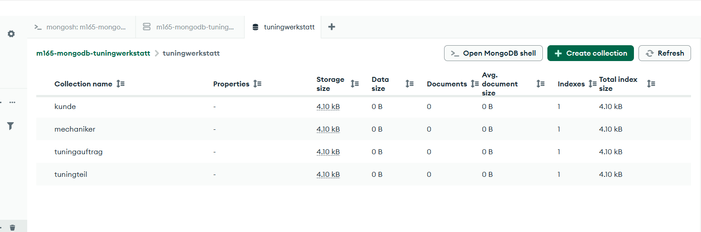

# KN-M-02: Datenmodellierung für MongoDB

**Autor:** Ramadan Asani
**Modul:** M165 - NoSQL-Datenbanken einsetzen
**Datum:** 20.05.2026
**Thema:** Tuning-Werkstatt

---

## Inhaltsverzeichnis

- [Themenwahl: Tuning-Werkstatt](#themenwahl-tuning-werkstatt)
- [A) Konzeptionelles Datenmodell](#a-konzeptionelles-datenmodell)
- [B) Logisches Modell für MongoDB](#b-logisches-modell-für-mongodb)
- [C) Anwendung des Schemas in MongoDB](#c-anwendung-des-schemas-in-mongodb)
- [Abgabe-Dateien](#abgabe-dateien)

---

## Themenwahl: Tuning-Werkstatt

Als Thema habe ich eine **Tuning-Werkstatt** gewählt. In so einem Betrieb bringen Kunden ihre Autos in die Werkstatt, damit sie umgebaut oder leistungsmässig aufgewertet werden (z.B. neues Fahrwerk, Auspuffanlage, Felgen, Chiptuning, Folierung). Jeder Umbau ist ein **Tuning-Auftrag** an einem **Auto** eines **Kunden**, bei dem **Tuning-Teile** verbaut und von einem oder mehreren **Mechanikern** ausgeführt werden.

Das Thema passt zu mir, weil ich mich privat für Autos und Tuning interessiere. Es weicht zudem von den typischen Themen meiner Klassenkameraden ab (Sport-Clubs, Musik-Bands).

---

## A) Konzeptionelles Datenmodell

### Vorgehen

Das konzeptionelle Modell ist die Grundlage und unabhängig vom Datenbank-Typ. Ich habe die Entitäten und Beziehungen aus der fachlichen Sicht modelliert, ohne mich bereits auf MongoDB-Spezifika festzulegen. Erstellt wurde das Diagramm in **draw.io** als ER-Diagramm mit den klassischen Kardinalitäten (1:N und N:N).

### Diagramm



### Entitäten

| Entität            | Bedeutung                                                                                                |
| ------------------ | -------------------------------------------------------------------------------------------------------- |
| **Kunde**          | Die Person, die ihr Auto in die Werkstatt bringt.                                                        |
| **Auto**           | Das Fahrzeug eines Kunden (mit Marke, Modell, Baujahr, Kennzeichen).                                     |
| **Tuning-Auftrag** | Ein konkreter Job an einem Auto, z.B. "AMG-Paket einbauen". Das ist das Kerngeschäft der Werkstatt.      |
| **Tuning-Teil**    | Ein einzelnes Bauteil, das verbaut werden kann (z.B. KW Gewindefahrwerk, Akrapovic-Auspuff, BBS-Felgen). |
| **Mechaniker**     | Mitarbeiter der Werkstatt, der einen Auftrag ausführt.                                                   |

### Beziehungen

| Beziehung                                    | Typ     | Bedeutung                                                                                                                                                                |
| -------------------------------------------- | ------- | ------------------------------------------------------------------------------------------------------------------------------------------------------------------------ |
| Kunde — besitzt — Auto                       | **1:N** | Ein Kunde kann mehrere Autos haben, aber jedes Auto gehört genau einem Kunden.                                                                                           |
| Auto — erhält — Tuning-Auftrag               | **1:N** | Ein Auto kann mehrere Aufträge bekommen (z.B. erst Auspuff, später Fahrwerk), aber ein Auftrag betrifft genau ein Auto.                                                  |
| Tuning-Auftrag — verwendet — Tuning-Teil     | **N:N** | Ein Auftrag verwendet mehrere Teile, und ein Teil (z.B. ein bestimmtes Fahrwerk) wird in vielen Aufträgen verbaut. Das ist die geforderte **netzwerkförmige Beziehung**. |
| Tuning-Auftrag — bearbeitet von — Mechaniker | **N:N** | Ein Auftrag kann von mehreren Mechanikern bearbeitet werden, und ein Mechaniker arbeitet an vielen Aufträgen.                                                            |

### Bedingungen erfüllt

- ✅ Mindestens 4 Entitäten (ich habe 5)
- ✅ Mindestens eine N:N-Beziehung (ich habe sogar 2)

---

## B) Logisches Modell für MongoDB

### Vorgehen

Das logische Modell übersetzt das konzeptionelle Schema in eine MongoDB-spezifische Struktur. Im Gegensatz zu relationalen Datenbanken muss man in MongoDB **für jede Beziehung entscheiden**, ob sie über **Einbettung** (Embedding) oder über **Referenzen** gelöst wird. Die Entscheidung hängt davon ab, wie die Daten später abgefragt werden.

### Diagramm



### Design-Entscheidungen pro Beziehung

#### 1. Kunde → Auto (1:N) — gelöst durch **Einbettung**

Autos sind direkt als Array `autos[]` im Kunde-Dokument eingebettet.

**Begründung:** Ein Auto gehört immer zu genau einem Kunden und existiert nicht unabhängig von ihm. Wenn ich die Daten eines Kunden anschaue, will ich praktisch immer auch seine Autos sehen (z.B. "welche Autos hat Müller bei uns?"). Mit Einbettung brauche ich nur eine Abfrage statt zwei (Vorteil: schneller, weniger Joins nötig).

#### 2. Auto → Tuning-Auftrag (1:N) — gelöst durch **Referenz**

Tuning-Auftrag ist eine **eigene Collection** mit einem Feld `autoId`, das auf das eingebettete Auto im Kunde-Dokument verweist.

**Begründung:** Tuning-Aufträge sind das **Kerngeschäft** der Werkstatt. Es wird oft nach Aufträgen gesucht — z.B. "alle offenen Aufträge", "alle Aufträge dieses Monats", "alle Aufträge mit Status fertig". Wäre der Auftrag im Auto eingebettet (und Auto im Kunde), müsste man bei jeder Abfrage das ganze Kunde-Dokument laden. Eine eigene Collection für Aufträge ist hier deutlich effizienter.

#### 3. Tuning-Auftrag ↔ Tuning-Teil (N:N) — gelöst durch **Many-to-Many mit Einbettung (Referenz-Array)**

Im Tuning-Auftrag-Dokument gibt es ein Array `tuningteilIds[]`, das die ObjectIds der verwendeten Teile enthält. Die Teile selbst sind eine eigene Collection.

**Begründung:** Tuning-Teile bilden einen **Katalog** und existieren unabhängig von Aufträgen — ein KW-Fahrwerk ist immer das gleiche, egal in wie vielen Aufträgen es verbaut wird. Würde man die Teile direkt einbetten, hätte man **massive Redundanz**: jedes Mal wenn das Fahrwerk verbaut wird, wäre es im Auftrag dupliziert. Wenn sich z.B. der Preis ändert, müsste man alle Aufträge updaten. Mit Referenzen wird das Teil einmal gespeichert und überall verlinkt.

#### 4. Tuning-Auftrag ↔ Mechaniker (N:N) — gelöst durch **Many-to-Many mit Einbettung (Referenz-Array)**

Im Tuning-Auftrag-Dokument gibt es ein Array `mechanikerIds[]` mit den ObjectIds der zugewiesenen Mechaniker. Mechaniker sind eine eigene Collection.

**Begründung:** Mechaniker sind feste Mitarbeiter der Werkstatt. Sie existieren unabhängig von Aufträgen und haben eigene Daten (Spezialisierung, Eintrittsdatum). Genau wie bei den Teilen wäre Einbettung redundant. Über die Referenz weiss jeder Auftrag, wer dran arbeitet, und gleichzeitig kann man durch die Collection auch fragen "an welchen Aufträgen arbeitet Mechaniker X gerade?".

### Resultat: 4 Collections

```
kunde            (mit eingebettetem Array autos[])
tuningauftrag    (mit Referenz-Array tuningteilIds[] und mechanikerIds[])
tuningteil       (eigenständige Collection)
mechaniker       (eigenständige Collection)
```

### Attribute pro Collection

#### Collection `kunde`

| Attribut     | Datentyp | Beschreibung                                        |
| ------------ | -------- | --------------------------------------------------- |
| `_id`        | ObjectId | Primärschlüssel, von MongoDB automatisch erstellt   |
| `vorname`    | string   | Vorname des Kunden                                  |
| `nachname`   | string   | Nachname des Kunden                                 |
| `telefon`    | string   | Telefonnummer (string, weil führende 0 wichtig ist) |
| `kundenSeit` | **date** | Datum der Erst-Registrierung                        |
| `autos[]`    | Array    | **Eingebettetes Array** mit Auto-Subdokumenten      |

**Eingebettete Auto-Subdokumente:**

| Attribut      | Datentyp | Beschreibung           |
| ------------- | -------- | ---------------------- |
| `kennzeichen` | string   | z.B. "ZH 123456"       |
| `marke`       | string   | z.B. "Mercedes-Benz"   |
| `modell`      | string   | z.B. "A-Klasse"        |
| `baujahr`     | **int**  | Jahr der Erstzulassung |
| `leistungPS`  | **int**  | Motorleistung in PS    |

#### Collection `tuningauftrag`

| Attribut          | Datentyp           | Beschreibung                                             |
| ----------------- | ------------------ | -------------------------------------------------------- |
| `_id`             | ObjectId           | Primärschlüssel                                          |
| `autoId`          | ObjectId           | **Referenz** auf das eingebettete Auto im Kunde-Dokument |
| `bezeichnung`     | string             | Name des Auftrags, z.B. "AMG-Paket einbauen"             |
| `startDatum`      | **date**           | Startdatum des Auftrags                                  |
| `gesamtpreis`     | **float**          | Gesamtpreis in CHF                                       |
| `status`          | **char**           | `O` = offen, `A` = in Arbeit, `F` = fertig               |
| `tuningteilIds[]` | Array von ObjectId | **Referenz-Array** auf tuningteil-Dokumente              |
| `mechanikerIds[]` | Array von ObjectId | **Referenz-Array** auf mechaniker-Dokumente              |

#### Collection `tuningteil`

| Attribut     | Datentyp  | Beschreibung                         |
| ------------ | --------- | ------------------------------------ |
| `_id`        | ObjectId  | Primärschlüssel                      |
| `name`       | string    | z.B. "KW Gewindefahrwerk V3"         |
| `hersteller` | string    | z.B. "KW Suspensions"                |
| `preis`      | **float** | Einzelpreis in CHF                   |
| `kategorie`  | string    | z.B. "Fahrwerk", "Auspuff", "Felgen" |

#### Collection `mechaniker`

| Attribut          | Datentyp | Beschreibung                              |
| ----------------- | -------- | ----------------------------------------- |
| `_id`             | ObjectId | Primärschlüssel                           |
| `vorname`         | string   | Vorname                                   |
| `nachname`        | string   | Nachname                                  |
| `spezialisierung` | string   | z.B. "Fahrwerktechnik", "Motorelektronik" |
| `eintrittsdatum`  | **date** | Datum des Stellenantritts                 |

### Datentyp-Übersicht

Alle in der Aufgabe geforderten Datentypen sind im Modell vorhanden:

| Geforderter Typ     | Wo verwendet                                                                         | ✅  |
| ------------------- | ------------------------------------------------------------------------------------ | --- |
| **int**             | `baujahr`, `leistungPS`                                                              | ✅  |
| **float**           | `gesamtpreis`, `preis`                                                               | ✅  |
| **string**          | `vorname`, `nachname`, `telefon`, `marke`, `modell`, `bezeichnung`, `kategorie`, ... | ✅  |
| **char**            | `status` (O / A / F)                                                                 | ✅  |
| **date**            | `kundenSeit`, `startDatum`, `eintrittsdatum`                                         | ✅  |
| **Verschachtelung** | `autos[]` als Array im Kunde-Dokument                                                | ✅  |

### Vergleich zu relationalen Datenbanken

In einer SQL-Datenbank hätte ich **5 Tabellen** plus **2 Zwischentabellen** (für die N:N-Beziehungen) gebraucht — also 7 Tabellen mit reinen Fremdschlüssel-Verknüpfungen. In MongoDB konnte ich das auf **4 Collections** reduzieren, weil:

- Die Beziehung Kunde-Auto durch Einbettung gelöst wurde (eine Collection weniger).
- Die zwei N:N-Beziehungen ohne Zwischentabellen über Referenz-Arrays funktionieren (zwei Collections weniger).

Das ist genau der Vorteil eines Document-Stores: man optimiert das Modell auf die tatsächlichen Abfragen statt sich an die strikte Normalisierung zu halten.

---

## C) Anwendung des Schemas in MongoDB

### Vorgehen

1. Mit Compass auf den MongoDB-Server aus KN-M-01 verbunden (IP nach Neustart: `54.198.102.191`).
2. Die integrierte MongoSH-Shell unten in Compass geöffnet.
3. Zuerst mit `use tuningwerkstatt` in die neue Datenbank gewechselt — **separat ausgeführt**, wie in der Aufgabe verlangt.
4. Anschliessend die 4 Collections mit `db.createCollection()` erstellt.
5. Mit `show collections` kontrolliert, dass alle 4 vorhanden sind.

### Skript

Das Skript ist in der Datei `KN-M-02_createCollections.js` gespeichert:

```javascript
// Schritt 1: In die Datenbank wechseln (separat ausführen!)
use tuningwerkstatt

// Schritt 2: Die 4 Collections erstellen
db.createCollection("kunde")
db.createCollection("tuningauftrag")
db.createCollection("tuningteil")
db.createCollection("mechaniker")

// Schritt 3: Kontrolle
show collections
```

### Erklärung der Befehle

| Befehl                        | Was er macht                                                                                                                                                                                              |
| ----------------------------- | --------------------------------------------------------------------------------------------------------------------------------------------------------------------------------------------------------- |
| `use tuningwerkstatt`         | Wechselt in die Datenbank `tuningwerkstatt`. Die DB wird automatisch erstellt, sobald die erste Collection darin angelegt wird. Vor dem `createCollection`-Aufruf existiert sie also noch nicht physisch. |
| `db.createCollection("name")` | Erstellt eine neue, leere Collection mit dem angegebenen Namen in der aktuellen Datenbank. Gibt bei Erfolg `{ ok: 1 }` zurück.                                                                            |
| `show collections`            | Listet alle Collections der aktuellen Datenbank auf. Verwendet zur Kontrolle, dass alle 4 Collections erstellt wurden.                                                                                    |

### Screenshot



Das Bild zeigt die Datenbank `tuningwerkstatt` in MongoDB Compass mit allen 4 erstellten Collections:

- `kunde`
- `mechaniker`
- `tuningauftrag`
- `tuningteil`

Jede Collection hat aktuell 0 Dokumente — sie sind leer, weil in dieser Aufgabe nur die Struktur erstellt werden sollte. Das Einfügen von Daten erfolgt in einer späteren Aufgabe.

### Hinweis zu JSON-Schemas

In dieser Aufgabe wurde **bewusst kein JSON-Schema** verwendet, wie in der Aufgabenstellung gefordert. Validierungs-Schemas (mit `bsonType` und `properties`) werden in einem späteren Kompetenznachweis hinzugefügt. Aktuell akzeptiert jede Collection beliebige Dokumente — das ist eine typische Eigenschaft von NoSQL-Datenbanken (schemalos im Vergleich zu SQL).

---

## Abgabe-Dateien

| Datei                                     | Inhalt                                                   |
| ----------------------------------------- | -------------------------------------------------------- |
| `KN-M-02_konzeptionell.drawio`            | Original-Datei des konzeptionellen ER-Modells            |
| `Bilder/KN-M-02_konzeptionell.png`        | Bild des konzeptionellen Modells                         |
| `KN-M-02_logisch.drawio`                  | Original-Datei des logischen MongoDB-Modells             |
| `Bilder/KN-M-02_logisch.png`              | Bild des logischen Modells mit Einbettung und Referenzen |
| `KN-M-02_createCollections.js`            | JavaScript-Skript zum Erstellen der 4 Collections        |
| `Bilder/KN-M-02_collections_erstellt.png` | Screenshot der erstellten Collections in Compass         |
| `KN-M-02_Modellierung.md`                 | Diese Dokumentation                                      |
