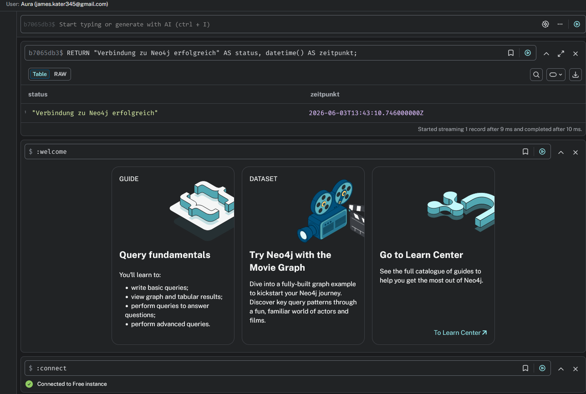
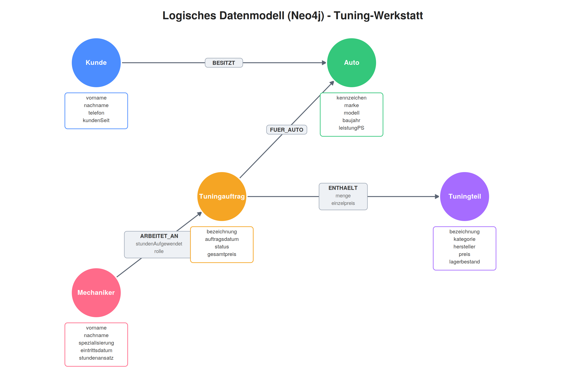

# KN-N-01: Installation und Datenmodellierung für Neo4j

**Autor:** Ramadan Asani
**Modul:** M165 - NoSQL-Datenbanken einsetzen
**Datum:** 03.06.2026
**Thema:** Tuning-Werkstatt (gleiches konzeptionelles Modell wie bei den MongoDB-KNs)

---

## Inhaltsverzeichnis

- [Ausgangslage](#ausgangslage)
- [A) Installation / Account erstellen](#a-installation--account-erstellen)
- [B) Logisches Modell für Neo4j](#b-logisches-modell-für-neo4j)
  - [Vom konzeptionellen Modell zum Graph](#vom-konzeptionellen-modell-zum-graph)
  - [Knoten und Kanten](#knoten-und-kanten)
  - [Das logische Datenmodell](#das-logische-datenmodell)
  - [Erklärung zur Verteilung der Attribute](#erklärung-zur-verteilung-der-attribute)
- [Abgabe-Dateien](#abgabe-dateien)

---

## Ausgangslage

Dieser Kompetenznachweis bildet den Einstieg in den Neo4j-Teil des Moduls. Es wird eine Neo4j-Datenbank eingerichtet und anschliessend ein **logisches Datenmodell** als Graph erstellt.

Als Grundlage dient dasselbe **konzeptionelle Modell** wie bei den MongoDB-Aufgaben (KN-M-02 bis KN-M-06): die **Tuning-Werkstatt** mit Kunden, deren Autos, Tuningaufträgen, Tuningteilen und Mechanikern. Während dieses Modell bei MongoDB als Dokumentstruktur mit Einbettungen und Referenzen umgesetzt wurde, wird es hier als Graph mit Knoten und Kanten abgebildet.

Als Datenbank wurde der Cloud-Dienst **Neo4j AuraDB Free** gewählt. Diese Variante ist kostenlos (ohne Kreditkarte), läuft direkt im Browser und benötigt – anders als die eigene AWS-Instanz aus den MongoDB-KNs – keine Verwaltung von wechselnden IP-Adressen. Für das logische Datenmodell (Teil B) ist keine laufende Datenbank nötig; die Verbindung wird nur in Teil A nachgewiesen.

---

## A) Installation / Account erstellen

### Vorgehen

1. Aufruf der Aura-Konsole unter <https://console.neo4j.io> und Erstellung eines kostenlosen Accounts.
2. Während des Onboardings wurde automatisch eine **AuraDB-Free-Instanz** angelegt (Status `RUNNING`).
3. Verbindung zur Instanz über das in der Aura-Konsole integrierte **Query-Tool** (`Connect` → `Query`).
4. Zum Nachweis, dass die Verbindung funktioniert, wurde eine kleine Cypher-Abfrage ausgeführt:

```cypher
RETURN "Verbindung zu Neo4j erfolgreich" AS status, datetime() AS zeitpunkt;
```

Die Abfrage liefert eine Zeile mit dem Status-Text und dem aktuellen Zeitstempel zurück. Damit ist belegt, dass die Datenbank erreichbar ist und Abfragen verarbeitet.

| Element             | Funktion                                                                                    |
| ------------------- | ------------------------------------------------------------------------------------------- |
| AuraDB Free         | Kostenlose, vollständig verwaltete Cloud-Instanz von Neo4j.                                 |
| Query-Tool          | In die Aura-Konsole integriertes Werkzeug zum Absetzen von Cypher-Abfragen.                 |
| `RETURN ... AS ...` | Cypher-Befehl, der berechnete Werte direkt zurückgibt – hier als einfacher Verbindungstest. |
| `datetime()`        | Cypher-Funktion, die den aktuellen Zeitstempel liefert.                                     |

### Screenshot



Der Screenshot zeigt das Query-Tool der Aura-Konsole. In der oberen Leiste ist die **Instanz grün (verbunden)**, die Datenbank-ID und der Benutzer sichtbar. Das Resultat der Abfrage (`"Verbindung zu Neo4j erfolgreich"` mit Zeitstempel) bestätigt, dass die Verbindung zur Datenbank funktioniert.

---

## B) Logisches Modell für Neo4j

### Vom konzeptionellen Modell zum Graph

Das konzeptionelle Modell der Tuning-Werkstatt wird nach den Migrationsregeln aus der Theorie in einen Graph überführt:

- **Entitäten werden zu Knoten** (mit einem Label pro Entitätstyp).
- **Beziehungen werden zu Kanten** (gerichtete Relationen zwischen Knoten).
- **Fremdschlüssel entfallen.** In einer Graphdatenbank wird die Verbindung direkt über die Kante abgebildet, es braucht keine ID-Felder zur Verknüpfung mehr.

Zwei wichtige Unterschiede zur MongoDB-Umsetzung:

1. **Das Auto wird ein eigener Knoten.** In MongoDB war das Auto im Kunde-Dokument _eingebettet_ (`autos[]`). Eine Einbettung gibt es im Graph nicht – stattdessen wird `Auto` ein eigenständiger Knoten, der über die Kante `BESITZT` mit dem Kunden verbunden ist. So kann auch ein Tuningauftrag direkt auf das betroffene Auto verweisen (`FUER_AUTO`).
2. **Die Referenz-Arrays werden zu Kanten.** Die in MongoDB als Arrays modellierten M:N-Beziehungen (`tuningteilIds`, `mechanikerIds`) werden zu den Kanten `ENTHAELT` und `ARBEITET_AN`. Genau diese Kanten tragen zusätzliche Attribute (siehe unten) – vergleichbar mit den Attributen einer Transformationstabelle in einem relationalen Modell.

### Knoten und Kanten

**Knoten (Labels) mit ihren Attributen:**

| Knoten (Label)  | Attribute                                                         |
| --------------- | ----------------------------------------------------------------- |
| `Kunde`         | vorname, nachname, telefon, kundenSeit                            |
| `Auto`          | kennzeichen, marke, modell, baujahr, leistungPS                   |
| `Tuningauftrag` | bezeichnung, auftragsdatum, status, gesamtpreis                   |
| `Tuningteil`    | bezeichnung, kategorie, hersteller, preis, lagerbestand           |
| `Mechaniker`    | vorname, nachname, spezialisierung, eintrittsdatum, stundenansatz |

**Kanten (Beziehungen):**

| Kante         | Richtung                   | Attribute                     |
| ------------- | -------------------------- | ----------------------------- |
| `BESITZT`     | Kunde → Auto               | –                             |
| `FUER_AUTO`   | Tuningauftrag → Auto       | –                             |
| `ENTHAELT`    | Tuningauftrag → Tuningteil | **menge, einzelpreis**        |
| `ARBEITET_AN` | Mechaniker → Tuningauftrag | **stundenAufgewendet, rolle** |

Die Bedingung der Aufgabenstellung (mindestens eine Kante mit Attributen) ist mit den Kanten `ENTHAELT` und `ARBEITET_AN` erfüllt.

### Das logische Datenmodell



Das Modell wurde mit draw.io erstellt. Die Original-Datei ist als `KN-N-01_Datenmodell.drawio` beigelegt. Es enthält ausschliesslich **Typen** (z.B. `Kunde`, `Auto`) und keine konkreten Inhalte, wie es die Aufgabenstellung verlangt.

### Erklärung zur Verteilung der Attribute

Der entscheidende Punkt bei der Datenmodellierung ist die Frage, ob ein Attribut zu einem **Knoten** oder zu einer **Kante** gehört. Die Grundregel: Ein Attribut beschreibt das, wozu es untrennbar gehört.

**Attribute auf Knoten** – beschreiben die Eigenschaften eines einzelnen Objekts und sind unabhängig von jeder Beziehung gültig:

- Ein `Tuningteil` hat einen `hersteller`, einen `preis` (Katalogpreis) und einen `lagerbestand` – diese Werte existieren, egal ob das Teil je in einem Auftrag verbaut wird.
- Ein `Kunde` hat `vorname`, `nachname` und `telefon`; ein `Auto` hat `kennzeichen`, `marke` und `leistungPS`. Das sind intrinsische Eigenschaften des jeweiligen Objekts und gehören deshalb auf den Knoten.
- Ein `Mechaniker` hat eine `spezialisierung` und einen `stundenansatz` – ebenfalls feste Eigenschaften der Person.

**Attribute auf Kanten** – beschreiben die konkrete Beziehung zwischen zwei Knoten und ergeben nur für diese Kombination einen Sinn:

- **`ENTHAELT { menge, einzelpreis }`** (Tuningauftrag → Tuningteil): `menge` gibt an, _wie viele_ Stück eines Teils in _diesem bestimmten_ Auftrag verbaut wurden. Diese Zahl gehört weder zum Tuningteil allein (das Teil hat keine feste Menge) noch zum Auftrag allein, sondern nur zur Verbindung der beiden. Das gleiche gilt für `einzelpreis`: der Preis, der für dieses Teil _in diesem Auftrag_ verrechnet wurde, kann vom aktuellen Katalogpreis abweichen (z.B. wegen Rabatt). Darum gehört er auf die Kante und nicht auf den Tuningteil-Knoten.
- **`ARBEITET_AN { stundenAufgewendet, rolle }`** (Mechaniker → Tuningauftrag): `stundenAufgewendet` beschreibt, wie viele Stunden ein _bestimmter_ Mechaniker an einem _bestimmten_ Auftrag gearbeitet hat – ein Wert, der nur für genau dieses Paar gilt. `rolle` (z.B. Hauptverantwortlicher oder Assistenz) ist ebenfalls eine Eigenschaft der Mitarbeit an diesem Auftrag und nicht des Mechanikers als Person.

**Kanten ohne Attribute:**

- `BESITZT` (Kunde → Auto) und `FUER_AUTO` (Tuningauftrag → Auto) sind reine Verknüpfungen. Sie drücken nur aus, _dass_ eine Beziehung besteht (wem das Auto gehört bzw. zu welchem Auto ein Auftrag gehört). Es gibt keine zusätzliche Information, die nur für diese Verbindung gilt, also bleiben sie attributlos.

Dieser Ansatz entspricht direkt den M:N-Beziehungen aus dem relationalen bzw. dem MongoDB-Modell: Die früheren Referenz-Arrays (`tuningteilIds`, `mechanikerIds`) waren faktisch Transformationstabellen. Solche Tabellen tragen oft eigene Attribute – und genau diese Attribute landen im Graphmodell auf den entsprechenden Kanten.

---

## Abgabe-Dateien

| Datei                                                     | Inhalt                                                    |
| --------------------------------------------------------- | --------------------------------------------------------- |
| `KN-N-01_Datenmodell.drawio`                              | Original-Datei des logischen Datenmodells (draw.io)       |
| `Bilder/A_verbindung.png`                                 | Screenshot: funktionierende Verbindung zur AuraDB-Instanz |
| `Bilder/B_datenmodell.png`                                | Bild des logischen Datenmodells                           |
| `KN-N-01_Installation_und_Datenmodellierung_für_Neo4j.md` | Diese Dokumentation                                       |
