# KN-N-02: Datenabfrage und -Manipulation für Neo4j

**Autor:** Ramadan Asani
**Modul:** M165 - NoSQL-Datenbanken einsetzen
**Datum:** 04.06.2026
**Thema:** Tuning-Werkstatt (gleiches konzeptionelles Modell wie bei den MongoDB-KNs und bei KN-N-01)

---

## Inhaltsverzeichnis

- [Ausgangslage](#ausgangslage)
- [A) Daten hinzufügen](#a-daten-hinzufügen)
- [B) Daten abfragen](#b-daten-abfragen)
  - [Alle Knoten und Kanten lesen (OPTIONAL)](#alle-knoten-und-kanten-lesen-optional)
  - [Szenario 1: Leistungsstarke, neue Autos](#szenario-1-leistungsstarke-neue-autos)
  - [Szenario 2: Kunde – Auto – Auftrag](#szenario-2-kunde--auto--auftrag)
  - [Szenario 3: Hauptverantwortliche mit hohem Aufwand](#szenario-3-hauptverantwortliche-mit-hohem-aufwand)
  - [Szenario 4: Teile-Wert pro Auftrag (Aggregation)](#szenario-4-teile-wert-pro-auftrag-aggregation)
- [C) Daten löschen (DETACH)](#c-daten-löschen-detach)
- [D) Daten verändern](#d-daten-verändern)
- [E) Zusätzliche Klauseln](#e-zusätzliche-klauseln)
- [Abgabe-Dateien](#abgabe-dateien)

---

## Ausgangslage

Dieser Kompetenznachweis baut direkt auf KN-N-01 auf. Dort wurde die Neo4j-Datenbank (AuraDB Free) eingerichtet und das logische Datenmodell der **Tuning-Werkstatt** als Graph definiert. In KN-N-02 wird dieses Modell nun mit echten Daten befüllt und mit Cypher abgefragt, gelöscht und verändert.

Das verwendete Modell (aus KN-N-01):

| Knoten (Label)  | Attribute                                                         |
| --------------- | ----------------------------------------------------------------- |
| `Kunde`         | vorname, nachname, telefon, kundenSeit                            |
| `Auto`          | kennzeichen, marke, modell, baujahr, leistungPS                   |
| `Tuningauftrag` | bezeichnung, auftragsdatum, status, gesamtpreis                   |
| `Tuningteil`    | bezeichnung, kategorie, hersteller, preis, lagerbestand           |
| `Mechaniker`    | vorname, nachname, spezialisierung, eintrittsdatum, stundenansatz |

| Kante         | Richtung                   | Attribute                 |
| ------------- | -------------------------- | ------------------------- |
| `BESITZT`     | Kunde → Auto               | –                         |
| `FUER_AUTO`   | Tuningauftrag → Auto       | –                         |
| `ENTHAELT`    | Tuningauftrag → Tuningteil | menge, einzelpreis        |
| `ARBEITET_AN` | Mechaniker → Tuningauftrag | stundenAufgewendet, rolle |

Als Werkzeug wurde durchgehend das in die Aura-Konsole integrierte **Query-Tool** verwendet.

---

## A) Daten hinzufügen

Der gesamte Datenbestand wird mit **einem einzigen, von Auge lesbar formatierten `CREATE`-Statement** angelegt. Eingefügt werden 4 Kunden, 5 Autos, 5 Tuningteile, 4 Mechaniker und 4 Tuningaufträge (22 Knoten) sowie die Beziehungen `BESITZT`, `FUER_AUTO`, `ENTHAELT` und `ARBEITET_AN` (22 Kanten). Der Datenbestand ist bewusst so gewählt, dass spätere Abfragen aussagekräftig sind (z.B. ein Kunde mit zwei Autos, ein Mechaniker an mehreren Aufträgen, Aufträge mit mehreren Teilen).

Das vollständige Skript liegt der Abgabe als `KN-N-02_A_Daten_hinzufuegen.txt` bei. Es ist ohne Anpassungen ausführbar; falls bereits Daten vorhanden sind, wird zuerst mit `MATCH (n) DETACH DELETE n;` geleert.

```cypher
CREATE
  // === Kunden ===
  (marko:Kunde  {vorname: 'Marko',  nachname: 'Petrovic', telefon: '079 234 56 78', kundenSeit: 2019}),
  (sandra:Kunde {vorname: 'Sandra', nachname: 'Keller',   telefon: '078 555 12 34', kundenSeit: 2021}),
  (luca:Kunde   {vorname: 'Luca',   nachname: 'Bianchi',  telefon: '076 888 99 00', kundenSeit: 2020}),
  (aisha:Kunde  {vorname: 'Aisha',  nachname: 'Demir',    telefon: '079 111 22 33', kundenSeit: 2023}),

  // === Autos ===
  (golf:Auto {kennzeichen: 'ZH 123456', marke: 'VW',       modell: 'Golf GTI', baujahr: 2018, leistungPS: 245}),
  (polo:Auto {kennzeichen: 'SG 345678', marke: 'VW',       modell: 'Polo GTI', baujahr: 2017, leistungPS: 200}),
  (m135:Auto {kennzeichen: 'ZH 654321', marke: 'BMW',      modell: 'M135i',    baujahr: 2020, leistungPS: 306}),
  (s3:Auto   {kennzeichen: 'AG 789012', marke: 'Audi',     modell: 'S3',       baujahr: 2019, leistungPS: 310}),
  (a45:Auto  {kennzeichen: 'ZH 456789', marke: 'Mercedes', modell: 'A45 AMG',  baujahr: 2021, leistungPS: 421}),

  // === Tuningteile ===
  (auspuff:Tuningteil    {bezeichnung: 'Sportauspuffanlage',          kategorie: 'Abgasanlage', hersteller: 'Akrapovic', preis: 2500.00, lagerbestand: 5}),
  (fahrwerk:Tuningteil   {bezeichnung: 'Gewindefahrwerk',             kategorie: 'Fahrwerk',    hersteller: 'KW',        preis: 1800.00, lagerbestand: 3}),
  (stage2:Tuningteil     {bezeichnung: 'Leistungssteigerung Stage 2', kategorie: 'Software',    hersteller: 'ABT',       preis: 1200.00, lagerbestand: 10}),
  (bremsen:Tuningteil    {bezeichnung: 'Big Brake Kit',               kategorie: 'Bremsen',     hersteller: 'Brembo',    preis: 3200.00, lagerbestand: 2}),
  (luftfilter:Tuningteil {bezeichnung: 'Sportluftfilter',             kategorie: 'Ansaugung',   hersteller: 'BMC',       preis: 350.00,  lagerbestand: 20}),

  // === Mechaniker ===
  (thomas:Mechaniker {vorname: 'Thomas', nachname: 'Frei',   spezialisierung: 'Motorenbau',          eintrittsdatum: 2015, stundenansatz: 95}),
  (elena:Mechaniker  {vorname: 'Elena',  nachname: 'Rossi',  spezialisierung: 'Fahrwerkstechnik',    eintrittsdatum: 2018, stundenansatz: 90}),
  (david:Mechaniker  {vorname: 'David',  nachname: 'Huber',  spezialisierung: 'Elektronik/Software', eintrittsdatum: 2020, stundenansatz: 100}),
  (nadia:Mechaniker  {vorname: 'Nadia',  nachname: 'Schmid', spezialisierung: 'Bremsen/Sicherheit',  eintrittsdatum: 2019, stundenansatz: 92}),

  // === Tuningaufträge ===
  (auftrag1:Tuningauftrag {bezeichnung: 'Golf GTI Performance Paket',   auftragsdatum: date('2024-03-15'), status: 'abgeschlossen',  gesamtpreis: 5900.00}),
  (auftrag2:Tuningauftrag {bezeichnung: 'BMW M135i Fahrwerk & Optik',   auftragsdatum: date('2024-05-20'), status: 'in Bearbeitung', gesamtpreis: 4500.00}),
  (auftrag3:Tuningauftrag {bezeichnung: 'Audi S3 Stage 2 Tuning',       auftragsdatum: date('2024-06-01'), status: 'in Bearbeitung', gesamtpreis: 2400.00}),
  (auftrag4:Tuningauftrag {bezeichnung: 'Mercedes A45 Bremsen-Upgrade', auftragsdatum: date('2024-02-10'), status: 'abgeschlossen',  gesamtpreis: 4100.00}),

  // === Kanten: BESITZT (Kunde -> Auto) ===
  (marko)-[:BESITZT]->(golf),
  (marko)-[:BESITZT]->(polo),
  (sandra)-[:BESITZT]->(m135),
  (luca)-[:BESITZT]->(s3),
  (aisha)-[:BESITZT]->(a45),

  // === Kanten: FUER_AUTO (Tuningauftrag -> Auto) ===
  (auftrag1)-[:FUER_AUTO]->(golf),
  (auftrag2)-[:FUER_AUTO]->(m135),
  (auftrag3)-[:FUER_AUTO]->(s3),
  (auftrag4)-[:FUER_AUTO]->(a45),

  // === Kanten: ENTHAELT (Tuningauftrag -> Tuningteil) mit {menge, einzelpreis} ===
  (auftrag1)-[:ENTHAELT {menge: 1, einzelpreis: 2500.00}]->(auspuff),
  (auftrag1)-[:ENTHAELT {menge: 1, einzelpreis: 1200.00}]->(stage2),
  (auftrag1)-[:ENTHAELT {menge: 1, einzelpreis: 350.00}]->(luftfilter),
  (auftrag2)-[:ENTHAELT {menge: 1, einzelpreis: 1800.00}]->(fahrwerk),
  (auftrag3)-[:ENTHAELT {menge: 1, einzelpreis: 1200.00}]->(stage2),
  (auftrag3)-[:ENTHAELT {menge: 1, einzelpreis: 350.00}]->(luftfilter),
  (auftrag4)-[:ENTHAELT {menge: 1, einzelpreis: 3200.00}]->(bremsen),

  // === Kanten: ARBEITET_AN (Mechaniker -> Tuningauftrag) mit {stundenAufgewendet, rolle} ===
  (thomas)-[:ARBEITET_AN {stundenAufgewendet: 12, rolle: 'Hauptverantwortlicher'}]->(auftrag1),
  (david)-[:ARBEITET_AN  {stundenAufgewendet: 4,  rolle: 'Assistenz'}]->(auftrag1),
  (elena)-[:ARBEITET_AN  {stundenAufgewendet: 8,  rolle: 'Hauptverantwortlicher'}]->(auftrag2),
  (david)-[:ARBEITET_AN  {stundenAufgewendet: 6,  rolle: 'Hauptverantwortlicher'}]->(auftrag3),
  (nadia)-[:ARBEITET_AN  {stundenAufgewendet: 10, rolle: 'Hauptverantwortlicher'}]->(auftrag4),
  (thomas)-[:ARBEITET_AN {stundenAufgewendet: 3,  rolle: 'Assistenz'}]->(auftrag4);
```

Nach der Ausführung meldet Neo4j _„Created 22 nodes, created 22 relationships, set 128 properties, added 22 labels"_. Links in der „Database information" werden entsprechend **Nodes (22)** und **Relationships (22)** angezeigt.

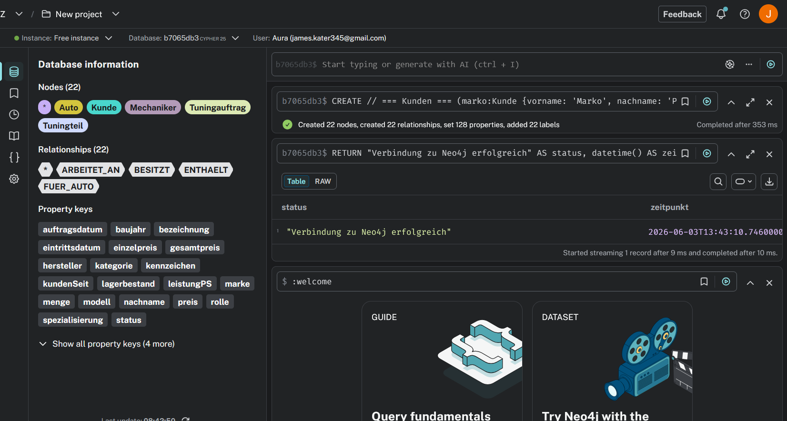

---

## B) Daten abfragen

### Alle Knoten und Kanten lesen (OPTIONAL)

```cypher
MATCH (n)
OPTIONAL MATCH (n)-[r]->(m)
RETURN n, r, m;
```

**Erklärung des Statements:**

- `MATCH (n)` sucht **alle Knoten** in der Datenbank, da kein Label und keine Bedingung angegeben sind. `n` ist die Variable für jeden gefundenen Knoten.
- `OPTIONAL MATCH (n)-[r]->(m)` sucht zu jedem Knoten `n` eine **ausgehende Kante** `r` zu einem Zielknoten `m`.
- Die **`OPTIONAL`-Klausel** ist der entscheidende Teil: Sie sorgt dafür, dass ein Knoten **auch dann im Ergebnis bleibt, wenn er keine ausgehende Kante hat**. In diesem Fall sind `r` und `m` schlicht `null`. Ohne `OPTIONAL` würde ein normales `MATCH` solche Knoten komplett aus dem Ergebnis entfernen. Das entspricht dem Unterschied zwischen einem `LEFT JOIN` (mit `OPTIONAL`, alle Knoten bleiben) und einem `INNER JOIN` (ohne, nur Knoten mit passender Kante) in SQL.
- `RETURN n, r, m` gibt Knoten, Kanten und Zielknoten zurück. In der Graph-Ansicht ist so der komplette Graph sichtbar.

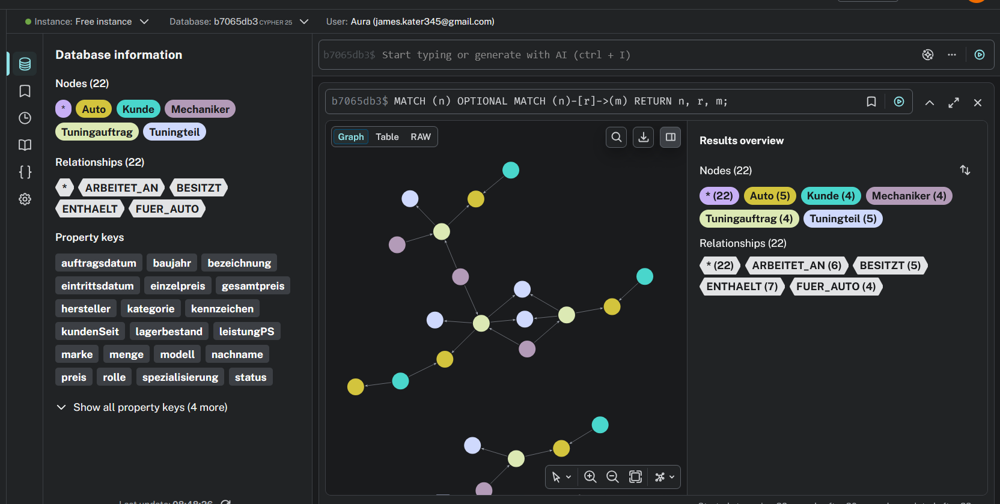

### Szenario 1: Leistungsstarke, neue Autos

**Anwendungsfall:** Für eine Marketing-Aktion sollen alle besonders sportlichen Fahrzeuge gefunden werden – Autos mit mehr als 300 PS, die ab Baujahr 2019 sind, sortiert nach Leistung absteigend. (Statement mit `WHERE`, Filter auf Knoten-Attribute.)

```cypher
MATCH (a:Auto)
WHERE a.leistungPS > 300 AND a.baujahr >= 2019
RETURN a.marke AS marke, a.modell AS modell, a.leistungPS AS ps, a.baujahr AS baujahr
ORDER BY ps DESC;
```

Ergebnis: Mercedes A45 AMG (421), Audi S3 (310), BMW M135i (306).

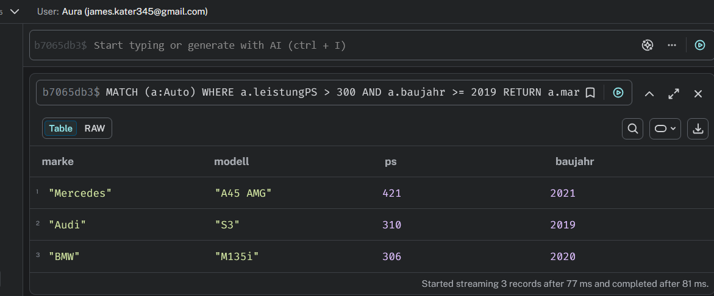

### Szenario 2: Kunde – Auto – Auftrag

**Anwendungsfall:** Am Empfang soll auf einen Blick sichtbar sein, welcher Kunde für welches seiner Autos welchen Tuningauftrag laufen hat (inkl. Status). Die Abfrage verbindet drei Knotentypen über zwei Kanten und nutzt dabei beide Pfeilrichtungen.

```cypher
MATCH (k:Kunde)-[:BESITZT]->(auto:Auto)<-[:FUER_AUTO]-(auftrag:Tuningauftrag)
RETURN k.vorname + ' ' + k.nachname AS kunde,
       auto.modell AS auto,
       auftrag.bezeichnung AS auftrag,
       auftrag.status AS status;
```

Ergebnis: vier Zeilen, je Kunde mit Auto, Auftrag und Status.

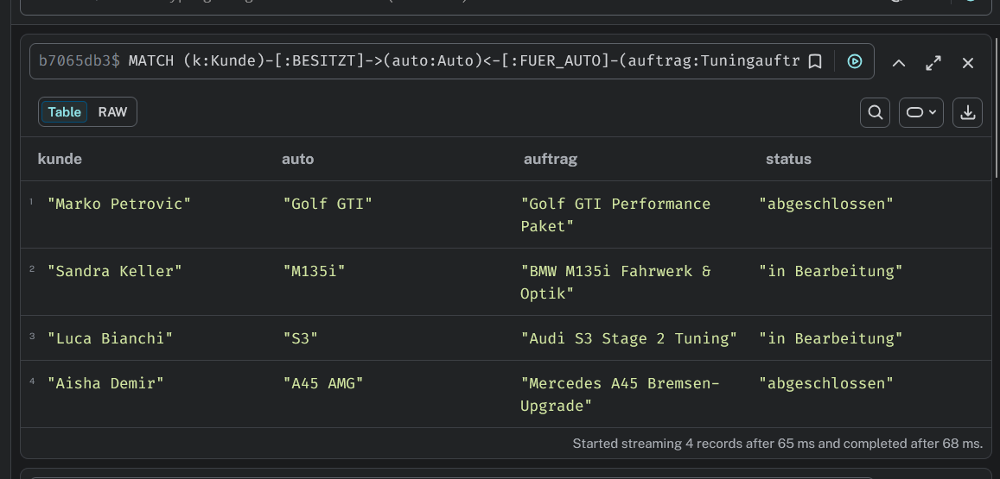

### Szenario 3: Hauptverantwortliche mit hohem Aufwand

**Anwendungsfall:** Der Werkstattleiter will die aufwändigsten Einsätze sehen – Mechaniker, die als **Hauptverantwortliche** mehr als 8 Stunden an einem Auftrag gearbeitet haben. Dieses Statement filtert mit `WHERE` auf **Kanten-Attribute** (`rolle`, `stundenAufgewendet`).

```cypher
MATCH (m:Mechaniker)-[r:ARBEITET_AN]->(auftrag:Tuningauftrag)
WHERE r.rolle = 'Hauptverantwortlicher' AND r.stundenAufgewendet > 8
RETURN m.vorname + ' ' + m.nachname AS mechaniker,
       auftrag.bezeichnung AS auftrag,
       r.stundenAufgewendet AS stunden
ORDER BY stunden DESC;
```

Ergebnis: Thomas Frei (12 Std., Golf GTI Performance Paket) und Nadia Schmid (10 Std., Mercedes A45 Bremsen-Upgrade).

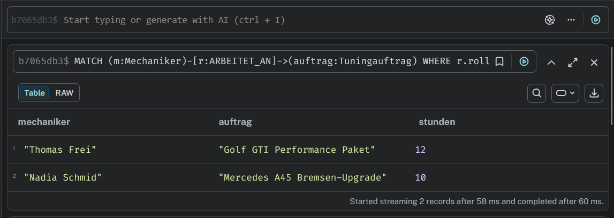

### Szenario 4: Teile-Wert pro Auftrag (Aggregation)

**Anwendungsfall:** Für die Kalkulation soll pro Auftrag gezeigt werden, wie viele Teile verbaut wurden und welchen Gesamtwert diese haben. Der Wert ergibt sich aus `menge × einzelpreis` der Kante `ENTHAELT`. Verwendet werden die Aggregatfunktionen `count()` und `sum()`.

```cypher
MATCH (auftrag:Tuningauftrag)-[r:ENTHAELT]->(teil:Tuningteil)
RETURN auftrag.bezeichnung AS auftrag,
       count(teil) AS anzahlTeile,
       sum(r.menge * r.einzelpreis) AS teileWert
ORDER BY teileWert DESC;
```

Ergebnis: Golf GTI Performance Paket (3 Teile / 4050), Mercedes A45 Bremsen-Upgrade (1 / 3200), BMW M135i (1 / 1800), Audi S3 (2 / 1550).

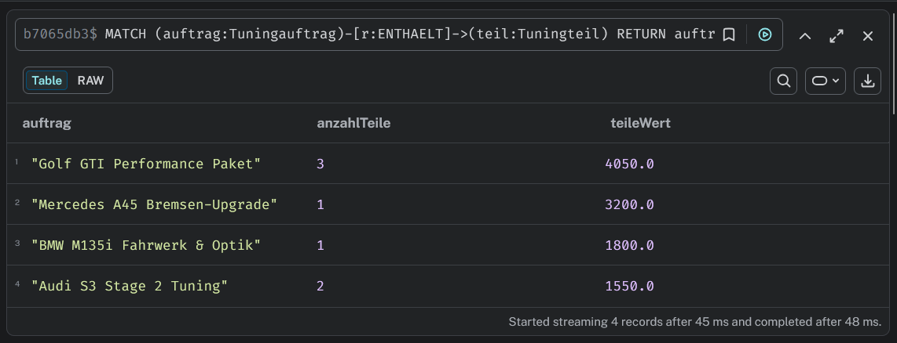

---

## C) Daten löschen (DETACH)

Getestet wird der Unterschied zwischen `DELETE` und `DETACH DELETE` am **gleichen Startobjekt** – dem Auto „Polo GTI" (Kennzeichen `SG 345678`), das über die Kante `BESITZT` mit dem Kunden Marko verbunden ist.

**Hintergrund:** Ein Knoten, der noch Beziehungen besitzt, kann mit einem einfachen `DELETE` nicht gelöscht werden – Neo4j bricht mit einem Fehler ab, um den Graphen konsistent zu halten. `DETACH DELETE` hingegen löscht zuerst alle Beziehungen des Knotens und dann den Knoten selbst.

### Fall 1 – ohne DETACH

**Vorher:** Der Polo und seine Beziehung existieren.

```cypher
MATCH (a:Auto {kennzeichen: 'SG 345678'})
OPTIONAL MATCH (a)<-[r:BESITZT]-(k:Kunde)
RETURN a.modell AS auto, a.kennzeichen AS kennzeichen, k.vorname AS besitzer;
```

Ergebnis: eine Zeile (Polo GTI / SG 345678 / Marko).

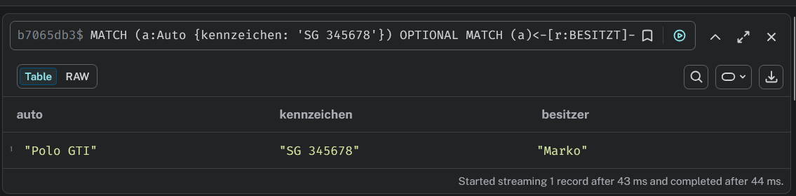

**Löschversuch ohne DETACH:**

```cypher
MATCH (a:Auto {kennzeichen: 'SG 345678'})
DELETE a;
```

**Nachher:** Neo4j bricht mit dem Fehler _„G1001: Dependent object error – edges still exist"_ ab. Es wird **nichts gelöscht**, der Polo bleibt unverändert bestehen. Genau das ist der Kern der Aufgabe: ohne `DETACH` ist das Löschen eines verbundenen Knotens nicht möglich.

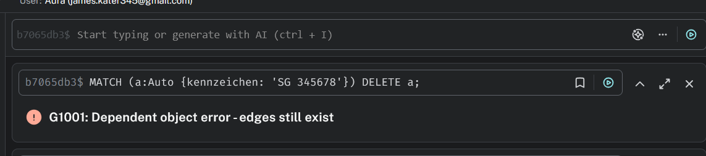

### Fall 2 – mit DETACH

**Vorher:** Da der vorige Versuch nichts gelöscht hat, existiert der Polo immer noch (dieselbe Prüfabfrage wie oben, weiterhin eine Zeile).

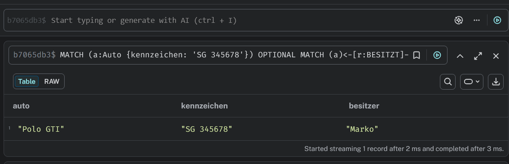

**Löschen mit DETACH:**

```cypher
MATCH (a:Auto {kennzeichen: 'SG 345678'})
DETACH DELETE a;
```

Ergebnis: _„Deleted 1 node, deleted 1 relationship"_ – der Knoten und seine Beziehung werden gemeinsam gelöscht.

**Nachher:** Die Prüfabfrage liefert nun **kein Ergebnis** mehr (0 Zeilen). Der Polo ist endgültig entfernt.

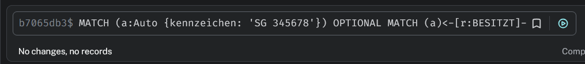

**Fazit:** Bei identischem Startobjekt scheitert `DELETE` an den vorhandenen Beziehungen, während `DETACH DELETE` Beziehungen und Knoten zusammen entfernt.

---

## D) Daten verändern

### Szenario 1: Mechaniker befördern (Knoten aktualisieren)

**Anwendungsfall:** David Huber hat sich weitergebildet und erhält einen höheren Stundenansatz (110) sowie eine erweiterte Spezialisierung. Es werden **zwei Attribute eines Knotens** gleichzeitig mit `SET` geändert.

```cypher
MATCH (m:Mechaniker {vorname: 'David', nachname: 'Huber'})
SET m.stundenansatz = 110,
    m.spezialisierung = 'Elektronik/Software/Diagnose'
RETURN m.vorname AS vorname, m.nachname AS nachname,
       m.stundenansatz AS stundenansatz, m.spezialisierung AS spezialisierung;
```

Ergebnis: _„Set 2 properties"_ – David Huber mit 110 und neuer Spezialisierung.

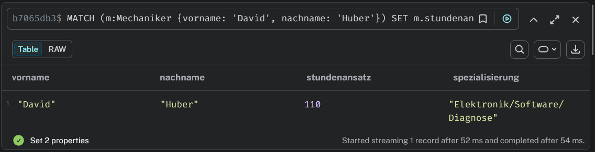

### Szenario 2: Rabatt auf ein Teil (Kanten-Attribut ändern)

**Anwendungsfall:** Beim Auftrag „Golf GTI Performance Paket" wird für die Sportauspuffanlage nachträglich ein Rabatt gewährt. Der `einzelpreis` auf der Kante `ENTHAELT` sinkt von 2500 auf 2200. Damit wird gezeigt, dass auch **Attribute einer Kante** mit `SET` verändert werden können.

```cypher
MATCH (auftrag:Tuningauftrag {bezeichnung: 'Golf GTI Performance Paket'})
      -[r:ENTHAELT]->
      (teil:Tuningteil {bezeichnung: 'Sportauspuffanlage'})
SET r.einzelpreis = 2200.00
RETURN auftrag.bezeichnung AS auftrag, teil.bezeichnung AS teil,
       r.menge AS menge, r.einzelpreis AS einzelpreis;
```

Ergebnis: _„Set 1 property"_ – einzelpreis nun 2200.

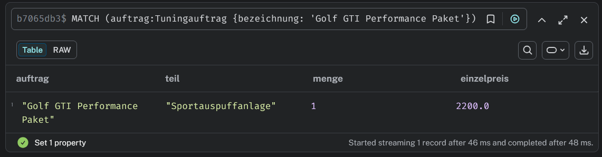

### Szenario 3: Offene Aufträge abschliessen (mehrere Knoten + neues Attribut)

**Anwendungsfall:** Zum Monatsende werden alle Aufträge mit Status „in Bearbeitung" auf „abgeschlossen" gesetzt und erhalten ein **neues Attribut `abschlussdatum`**. Besonders: Es werden **mehrere Knoten auf einmal** über `WHERE` ausgewählt und es wird ein Attribut hinzugefügt, das vorher nicht existierte.

```cypher
MATCH (auftrag:Tuningauftrag)
WHERE auftrag.status = 'in Bearbeitung'
SET auftrag.status = 'abgeschlossen',
    auftrag.abschlussdatum = date('2024-06-30')
RETURN auftrag.bezeichnung AS auftrag, auftrag.status AS status,
       auftrag.abschlussdatum AS abschlussdatum;
```

Ergebnis: _„Set 4 properties"_ – BMW M135i und Audi S3 sind nun abgeschlossen, beide mit Abschlussdatum 2024-06-30.

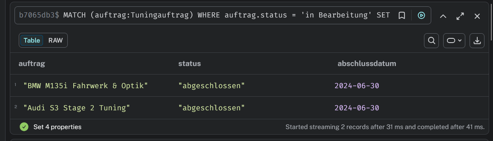

---

## E) Zusätzliche Klauseln

Gewählt wurden zwei Klauseln, die in den Teilen A–D nicht verwendet wurden: `WITH` und `MERGE`. (Die Wahl wurde mit den Tischnachbarn abgesprochen, damit keine Dopplungen entstehen.)

### Klausel 1: `WITH`

**Erklärung:** `WITH` leitet Zwischenergebnisse von einem Abfrageteil an den nächsten weiter – vergleichbar mit einer Pipeline. Der wichtigste Nutzen: Man kann damit **auf ein bereits aggregiertes Ergebnis filtern**. Eine normale `WHERE`-Klausel kann nicht auf eine Summe zugreifen, die erst im `RETURN` gebildet würde. Mit `WITH` wird die Summe zuerst berechnet, weitergegeben und anschliessend gefiltert.

**Anwendungsfall:** Finde alle Mechaniker, die über alle Aufträge hinweg insgesamt mehr als 10 Stunden gearbeitet haben.

```cypher
MATCH (m:Mechaniker)-[r:ARBEITET_AN]->(:Tuningauftrag)
WITH m, sum(r.stundenAufgewendet) AS gesamtStunden
WHERE gesamtStunden > 10
RETURN m.vorname + ' ' + m.nachname AS mechaniker, gesamtStunden
ORDER BY gesamtStunden DESC;
```

Ergebnis: Thomas Frei mit 15 Stunden (12 + 3). Hier wird sichtbar, dass die Filterung (`gesamtStunden > 10`) erst **nach** der Aggregation möglich ist – genau dafür ist `WITH` nötig.

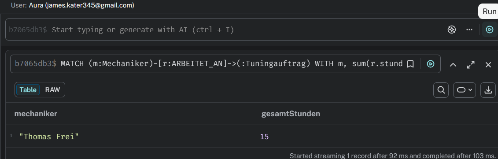

### Klausel 2: `MERGE`

**Erklärung:** `MERGE` kombiniert Suchen und Erstellen: „finde den Knoten, und falls er noch nicht existiert, erstelle ihn". Damit werden **Duplikate vermieden** – führt man dasselbe `MERGE` mehrmals aus, wird der Knoten nur einmal angelegt. Mit `ON CREATE SET` lassen sich Attribute setzen, die **nur beim erstmaligen Erstellen** vergeben werden.

**Anwendungsfall:** Die Werkstatt nimmt das neue Tuningteil „Domstrebe" ins Sortiment auf, ohne es versehentlich doppelt anzulegen.

```cypher
MERGE (t:Tuningteil {bezeichnung: 'Domstrebe'})
ON CREATE SET t.kategorie = 'Karosserie',
              t.hersteller = 'Wiechers',
              t.preis = 450.00,
              t.lagerbestand = 8
RETURN t.bezeichnung AS teil, t.kategorie AS kategorie,
       t.hersteller AS hersteller, t.preis AS preis;
```

Beim ersten Ausführen meldet Neo4j _„Created 1 node, set 5 properties, added 1 label"_. Führt man dasselbe Statement erneut aus, wird **kein** zweiter Knoten erstellt (no changes) – das Teil bleibt einmalig. Genau das ist der Vorteil von `MERGE` gegenüber `CREATE`.

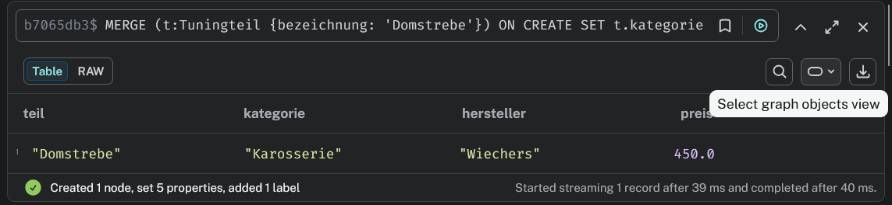

---

## Abgabe-Dateien

| Datei                                            | Inhalt                                                         |
| ------------------------------------------------ | -------------------------------------------------------------- |
| `KN-N-02_A_Daten_hinzufuegen.txt`                | Ausführbares CREATE-Skript zum Befüllen der Datenbank (Teil A) |
| `Bilder/A_create.png`                            | Screenshot: CREATE ausgeführt (22 Knoten / 22 Kanten)          |
| `Bilder/B_alle.png`                              | Screenshot: alle Knoten und Kanten (Graph)                     |
| `Bilder/B_szenario1.png` … `B_szenario4.png`     | Screenshots der vier Abfrage-Szenarien                         |
| `Bilder/C_ohne_vorher.png`, `C_ohne_nachher.png` | Löschen ohne DETACH: vorher / Fehler                           |
| `Bilder/C_mit_vorher.png`, `C_mit_nachher.png`   | Löschen mit DETACH: vorher / gelöscht                          |
| `Bilder/D_szenario1.png` … `D_szenario3.png`     | Screenshots der drei Update-Szenarien                          |
| `Bilder/E_with.png`, `Bilder/E_merge.png`        | Screenshots der zwei zusätzlichen Klauseln (optional)          |
| `KN-N-02_Datenabfrage_und_Manipulation.md`       | Diese Dokumentation                                            |
