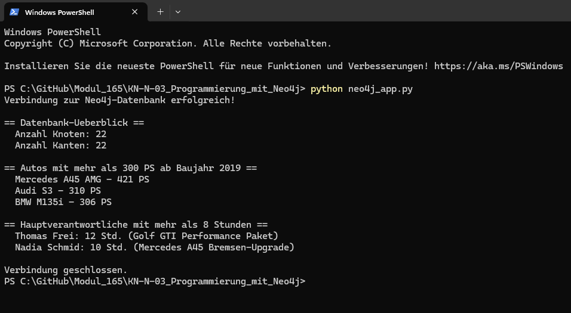

# KN-N-03: Programmierung mit Neo4j

**Autor:** Ramadan Asani
**Modul:** M165 - NoSQL-Datenbanken einsetzen
**Datum:** 04.06.2026
**Thema:** Tuning-Werkstatt (gleiche Datenbank wie in KN-N-01 und KN-N-02)

---

## Inhaltsverzeichnis

- [Ausgangslage](#ausgangslage)
- [Gewählte Sprache und Bibliothek](#gewählte-sprache-und-bibliothek)
- [Vorbereitung](#vorbereitung)
  - [Treiber installieren](#treiber-installieren)
  - [Zugangsdaten](#zugangsdaten)
- [Das Programm](#das-programm)
- [Ausführung und Ergebnis](#ausführung-und-ergebnis)
- [Erklärung der Abfragen](#erklärung-der-abfragen)
- [Sicherheitshinweis](#sicherheitshinweis)
- [Abgabe-Dateien](#abgabe-dateien)

---

## Ausgangslage

In diesem Kompetenznachweis wird die bestehende Neo4j-Datenbank (Tuning-Werkstatt aus KN-N-01 und KN-N-02) nicht mehr über das Query-Tool, sondern über eine **Programmiersprache** angesprochen. Ziel ist nicht eine bestimmte Architektur, sondern das Kennenlernen einer **Bibliothek (Treiber)**, mit der man aus dem Programmcode heraus auf die Datenbank zugreift und Cypher-Abfragen ausführt.

Als Datenbank dient eine **AuraDB-Free-Instanz**. Da die ursprüngliche Instanz keine gespeicherten Zugangsdaten hatte (das Passwort wird beim Free-Onboarding nur einmalig angezeigt), wurde eine neue Free-Instanz `M165-TuningWerkstatt` erstellt, deren Zugangsdaten gesichert wurden. Die Daten wurden anschliessend mit dem `CREATE`-Skript aus KN-N-02 wieder eingespielt (22 Knoten, 22 Kanten).

---

## Gewählte Sprache und Bibliothek

- **Sprache:** Python 3.13
- **Bibliothek:** offizieller **Neo4j Python Driver** (`neo4j`)

Python wurde gewählt, weil der Zugriff damit besonders einfach ist: Es genügt eine einzige Installation, es ist keine Kompilierung nötig, und der offizielle Treiber von Neo4j ist gut dokumentiert. Einstiegspunkt war die offizielle Seite <https://neo4j.com/docs/create-applications/> bzw. der Python-Treiber unter <https://neo4j.com/docs/python-manual/current/>.

---

## Vorbereitung

### Treiber installieren

Der Treiber wird über den Paketmanager `pip` installiert:

```bash
python -m pip install neo4j
```

Installiert wurde die Version `neo4j 6.2.0`.

### Zugangsdaten

Für den Zugriff über den Treiber braucht es drei Angaben, die in der von Aura heruntergeladenen Credentials-Datei stehen:

- **URI** (Verbindungsadresse, verschlüsselt über das Bolt-Protokoll): `neo4j+s://<instanz-id>.databases.neo4j.io`
- **Benutzername**
- **Passwort**

Wichtig: Anders als beim Browser-Query-Tool (das über die angemeldete Web-Sitzung verbindet) benötigt ein externes Programm immer URI, Benutzername und Passwort.

---

## Das Programm

Das Skript `neo4j_app.py` baut mit dem Treiber eine Verbindung auf und führt drei Abfragen aus. Die Zugangsdaten werden **automatisch aus der Credentials-Datei** (`Neo4j-...-Created-....txt`) gelesen, die im selben Ordner liegt – so steht kein Passwort im Code.

```python
import glob
import os
import sys

from neo4j import GraphDatabase


def lade_zugangsdaten():
    """Liest URI, Benutzername und Passwort aus der Aura-Credentials-Datei."""
    ordner = os.path.dirname(os.path.abspath(__file__))
    treffer = glob.glob(os.path.join(ordner, "Neo4j-*.txt"))
    if not treffer:
        sys.exit("FEHLER: Keine Datei 'Neo4j-*.txt' im Skript-Ordner gefunden.")

    werte = {}
    with open(treffer[0], encoding="utf-8") as datei:
        for zeile in datei:
            zeile = zeile.strip()
            if not zeile or zeile.startswith("#") or "=" not in zeile:
                continue
            schluessel, wert = zeile.split("=", 1)
            werte[schluessel.strip()] = wert.strip()

    return werte["NEO4J_URI"], werte["NEO4J_USERNAME"], werte["NEO4J_PASSWORD"]


def main():
    uri, benutzer, passwort = lade_zugangsdaten()

    # Treiber aufbauen und Verbindung pruefen
    driver = GraphDatabase.driver(uri, auth=(benutzer, passwort))
    driver.verify_connectivity()
    print("Verbindung zur Neo4j-Datenbank erfolgreich!\n")

    # 1) Ueberblick: Anzahl Knoten und Kanten
    print("== Datenbank-Ueberblick ==")
    records, _, _ = driver.execute_query("MATCH (n) RETURN count(n) AS knoten")
    print(f"  Anzahl Knoten: {records[0]['knoten']}")
    records, _, _ = driver.execute_query("MATCH ()-[r]->() RETURN count(r) AS kanten")
    print(f"  Anzahl Kanten: {records[0]['kanten']}\n")

    # 2) Starke, neue Autos - Abfrage mit Parametern
    print("== Autos mit mehr als 300 PS ab Baujahr 2019 ==")
    records, _, _ = driver.execute_query(
        """
        MATCH (a:Auto)
        WHERE a.leistungPS > $min_ps AND a.baujahr >= $min_jahr
        RETURN a.marke AS marke, a.modell AS modell, a.leistungPS AS ps
        ORDER BY ps DESC
        """,
        min_ps=300,
        min_jahr=2019,
    )
    for r in records:
        print(f"  {r['marke']} {r['modell']} - {r['ps']} PS")
    print()

    # 3) Hauptverantwortliche mit mehr als 8 Stunden - Abfrage ueber Kanten-Attribute
    print("== Hauptverantwortliche mit mehr als 8 Stunden ==")
    records, _, _ = driver.execute_query(
        """
        MATCH (m:Mechaniker)-[r:ARBEITET_AN]->(auftrag:Tuningauftrag)
        WHERE r.rolle = 'Hauptverantwortlicher' AND r.stundenAufgewendet > 8
        RETURN m.vorname + ' ' + m.nachname AS mechaniker,
               auftrag.bezeichnung AS auftrag,
               r.stundenAufgewendet AS stunden
        ORDER BY stunden DESC
        """
    )
    for r in records:
        print(f"  {r['mechaniker']}: {r['stunden']} Std. ({r['auftrag']})")
    print()

    driver.close()
    print("Verbindung geschlossen.")


if __name__ == "__main__":
    main()
```

---

## Ausführung und Ergebnis

Das Skript wird im Terminal im selben Ordner ausgeführt:

```bash
python neo4j_app.py
```

Die Ausgabe bestätigt die erfolgreiche Verbindung und liefert die Ergebnisse der drei Abfragen:

```
Verbindung zur Neo4j-Datenbank erfolgreich!

== Datenbank-Ueberblick ==
  Anzahl Knoten: 22
  Anzahl Kanten: 22

== Autos mit mehr als 300 PS ab Baujahr 2019 ==
  Mercedes A45 AMG - 421 PS
  Audi S3 - 310 PS
  BMW M135i - 306 PS

== Hauptverantwortliche mit mehr als 8 Stunden ==
  Thomas Frei: 12 Std. (Golf GTI Performance Paket)
  Nadia Schmid: 10 Std. (Mercedes A45 Bremsen-Upgrade)

Verbindung geschlossen.
```



---

## Erklärung der Abfragen

- **`GraphDatabase.driver(uri, auth=(benutzer, passwort))`** erstellt das zentrale Treiber-Objekt. `driver.verify_connectivity()` prüft, ob die Verbindung zur Datenbank wirklich steht.
- **`driver.execute_query(...)`** ist der einfachste Weg, eine Cypher-Abfrage auszuführen. Die Methode gibt drei Dinge zurück: die Ergebnis-Datensätze (`records`), eine Zusammenfassung und die Spalten-Namen. Im Code werden nur die `records` verwendet; auf einzelne Spalten wird per Name zugegriffen (z.B. `r['marke']`).
- **Abfrage 1** zählt mit `count()` alle Knoten bzw. alle Kanten – ein einfacher Verbindungs- und Datenbestandstest.
- **Abfrage 2** verwendet **Parameter** (`$min_ps`, `$min_jahr`) statt fest in den Text geschriebene Werte. Das ist die empfohlene Vorgehensweise: Die Werte werden getrennt vom Abfrage-Text übergeben, was sicherer und wiederverwendbar ist.
- **Abfrage 3** greift über die Kante `ARBEITET_AN` auf deren Attribute (`rolle`, `stundenAufgewendet`) zu und filtert mit `WHERE` – dieselbe Logik wie im Query-Tool, nur jetzt aus dem Python-Programm heraus.

Damit ist gezeigt, dass dieselben Cypher-Abfragen wie in den vorherigen KNs auch programmatisch über den Treiber ausgeführt werden können.

---

## Sicherheitshinweis

Die Credentials-Datei (`Neo4j-...-Created-....txt`) enthält das Datenbank-Passwort und sollte **nicht** in ein öffentliches Git-Repository gelangen. Dafür wird sie in der `.gitignore` ausgeschlossen, z.B. mit dem Eintrag:

```
Neo4j-*.txt
```

So bleibt das Passwort lokal, während das Skript selbst (ohne Passwort) problemlos versioniert werden kann.

---

## Abgabe-Dateien

| Datei                                 | Inhalt                                                 |
| ------------------------------------- | ------------------------------------------------------ |
| `neo4j_app.py`                        | Python-Skript, das über den Treiber auf Neo4j zugreift |
| `Bilder/ausgabe.png`                  | Screenshot der erfolgreichen Ausführung im Terminal    |
| `KN-N-03_Programmierung_mit_Neo4j.md` | Diese Dokumentation                                    |
